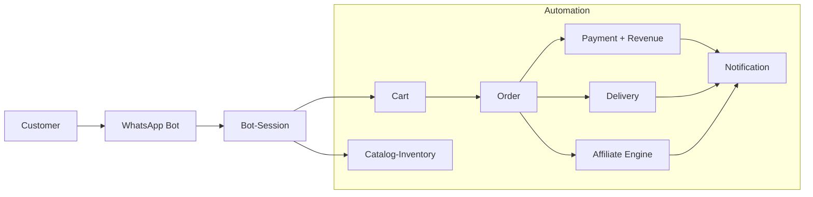
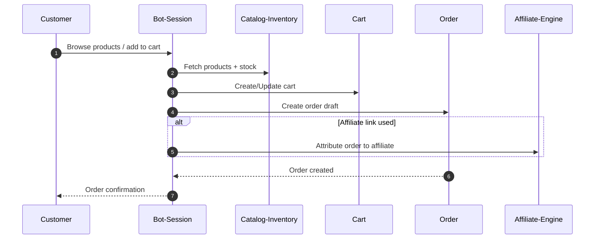
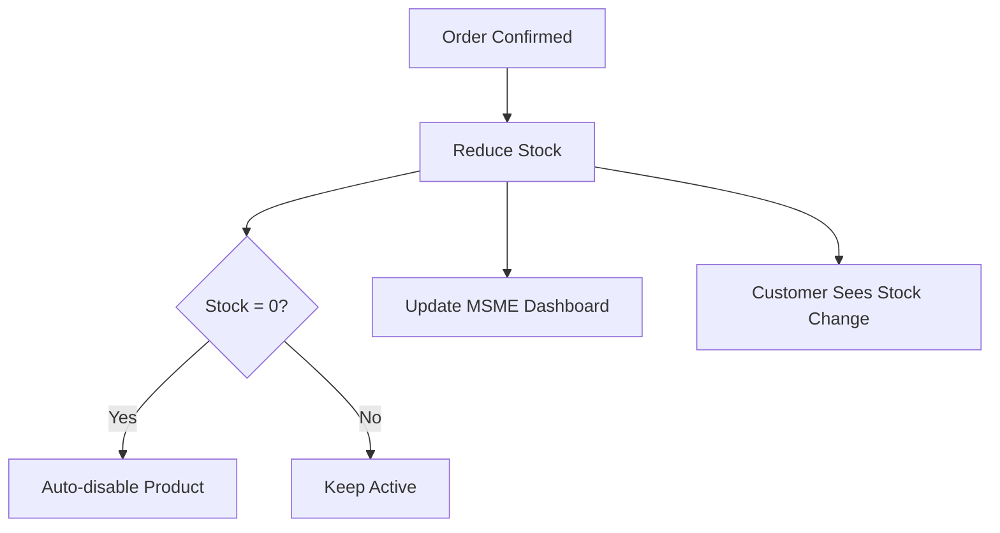
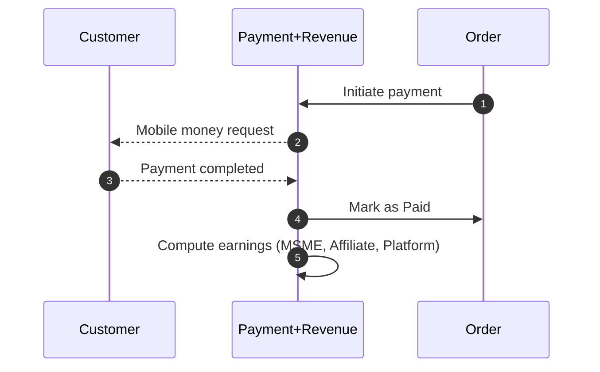
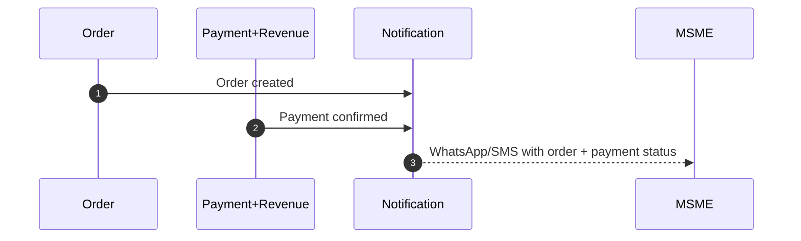
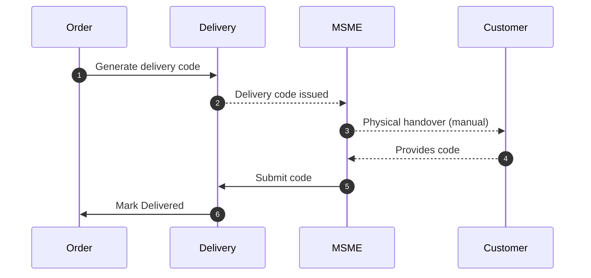
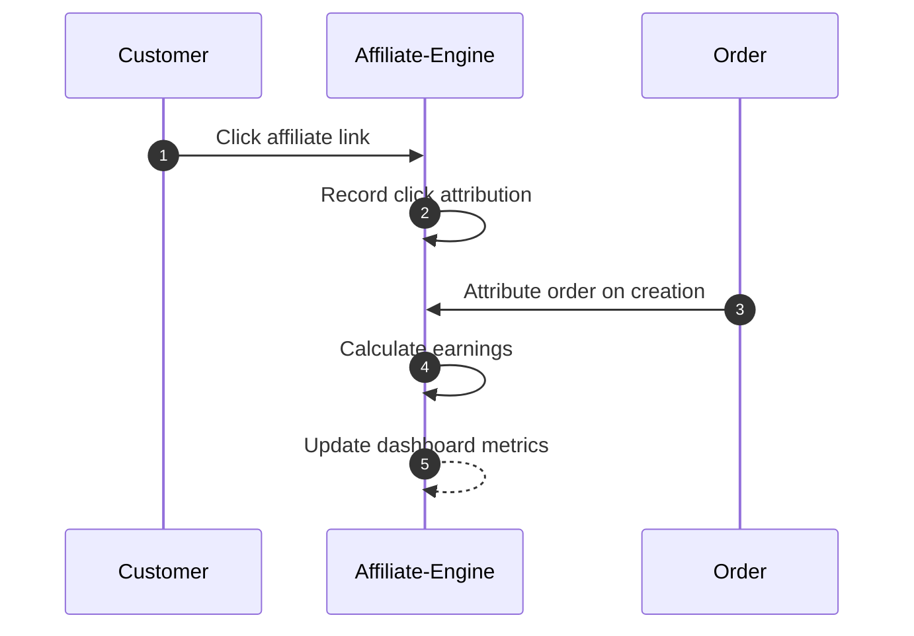
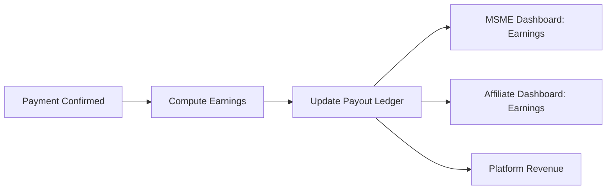

# Bot Session Workflows Documentation

## Overview

The bot session system is a microservices architecture that handles conversational commerce through WhatsApp, SMS, and Web chat. It uses Redis streams for async communication, tree-based navigation for workflows, and integrates with ICE (Integration and Coordination Engine) for backend operations.

---

## Architecture Diagram

```
┌──────────────┐         ┌─────────────┐         ┌──────────────┐
│   WhatsApp   │         │     SMS     │         │   Webchat    │
│   Provider   │         │   Provider  │         │   Frontend   │
└──────┬───────┘         └──────┬──────┘         └──────┬───────┘
       │                        │                        │
       └────────────────────────┼────────────────────────┘
                                │
                         ┌──────▼──────┐
                         │   Ingress   │
                         │   Service   │
                         └──────┬──────┘
                                │
                    ┌───────────┴───────────┐
                    │   Redis Stream Lane   │
                    │   bot:lane:{type}     │
                    └───────────┬───────────┘
                                │
                ┌───────────────┼───────────────┐
                │               │               │
         ┌──────▼──────┐ ┌─────▼──────┐ ┌─────▼────────┐
         │   Default   │ │   Custom   │ │    Intent    │
         │ Bot Service │ │ Bot Service│ │   Service    │
         └──────┬──────┘ └─────┬──────┘ └──────────────┘
                │               │
                └───────┬───────┘
                        │
                 ┌──────▼──────┐
                 │    Reply    │
                 │   Service   │
                 └──────┬──────┘
                        │
                 ┌──────▼──────┐
                 │  Outbound   │
                 │   Service   │
                 └──────┬──────┘
                        │
        ┌───────────────┼───────────────┐
        │               │               │
   ┌────▼────┐    ┌────▼────┐    ┌────▼────┐
   │WhatsApp │    │   SMS   │    │ Webchat │
   │Provider │    │Provider │    │Frontend │
   └─────────┘    └─────────┘    └─────────┘

         ┌──────────────────────────────┐
         │  ICE (Integration Engine)    │
         │  - Hydration                 │
         │  - Reservation               │
         │  - Order Confirmation        │
         └──────────────────────────────┘
```

---

## Service Responsibilities

### 1. Bot Ingress Service

**Purpose**: Entry point for all incoming messages. Validates, enriches, and routes messages to appropriate bot lanes.

**Consumes**: 
- `ingress:incoming` Redis stream (raw messages from providers)

**Produces**:
- `bot:lane:default` - For public/registration flows
- `bot:lane:custom` - For customer/MSME/affiliate flows
- `ingress:resolved_payload` - Audit trail

**Key Operations**:
1. **Validation**: Verify message structure, sender ID, channel
2. **Bot Resolution**: Determine bot type (default vs custom)
3. **User Lookup**: Identify user and their role (public, customer, MSME, affiliate, staff)
4. **Enrichment**: Add session context, capabilities, user metadata
5. **Routing**: Publish to appropriate lane based on bot type
6. **Caching**: Cache bot/user lookups for performance

**Environment Variables**:
```bash
INGRESS_CACHE_ENABLED=True
INGRESS_BOT_CACHE_TTL=3600
INGRESS_USER_CACHE_TTL=900
INGRESS_CAPABILITIES_CACHE_TTL=3600
INGRESS_SESSION_CONTEXT_TTL=1800
ICE_SERVICE_URL=http://ice-service:8600
ICE_PRELOAD_PATH=/api/v1/hydrate/session
REDIS_KV_READ_ONLY=False  # Set True to disable cache writes
REDIS_STREAM_PUBLISH_ENABLED=True
```

**Enriched Payload Schema**:
```json
{
  "event_id": "evt_20260204_001",
  "session_id": "sess_abc123",
  "bot_id": "bot_msme_456",
  "bot_type": "custom",
  "user_id": "user_789",
  "channel": "whatsapp",
  "from": "260971234567",
  "to": "260971111111",
  "message": {
    "text": "I want 3 solar panels",
    "type": "text",
    "timestamp": "2026-02-04T10:30:00Z"
  },
  "enriched": {
    "user_role": "customer",
    "business_id": "biz_456",
    "affiliate_id": "aff_789",
    "session_mode": "registered",
    "capabilities": ["cart", "checkout", "payment"],
    "session_context": {
      "last_interaction": "2026-02-04T09:00:00Z",
      "current_node": "serve_products"
    }
  },
  "metadata": {
    "trace_id": "trace_xyz",
    "idempotency_key": "evt_20260204_001",
    "schema_version": "1.0"
  }
}
```

---

### 2. Bot Intent Service

**Purpose**: Resolves user intent using AI (Gemini) when required for ambiguous inputs.

**Consumes**:
- `intent:requests` Redis stream (only when `intent_required=true`)

**Produces**:
- `intent:results` - Resolved intent with confidence scores
- `intent:dlq` - Failed intent resolutions

**When Intent is Required**:
- Ambiguous product requests: "I want solar stuff"
- Corrections: "Change the quantity"
- Complex queries: "What's the cheapest panel with 200W?"
- Free-form inputs that don't match menu options

**Intent Resolution Process**:
1. **Context Assembly**: Gather session history, current cart, product catalog
2. **Gemini Call**: Send context + user message to Gemini API
3. **Intent Extraction**: Parse intent name, confidence, and slots
4. **Publishing**: Publish result correlated by `event_id`

**Intent Result Schema**:
```json
{
  "event_id": "evt_20260204_001",
  "session_id": "sess_abc123",
  "intent": "add_to_cart",
  "confidence": 0.92,
  "slots": {
    "product_id": "p_123",
    "product_name": "Solar Panel A",
    "quantity": 3
  },
  "fallback_used": false,
  "processing_time_ms": 450
}
```

**Fallback Strategy**:
- **Primary**: Gemini API
- **Secondary**: Rule-based pattern matching
- **Tertiary**: Use last node context

---

### 3. Default Bot Service

**Purpose**: Handles public users and simple menu-driven flows (registration, catalog browsing, basic orders).

**Consumes**:
- `bot:lane:default` Redis stream

**Produces**:
- `reply:requests` - Reply generation requests
- `default-bot:dlq` - Failed processing

**Tree-Based Navigation**:

The Default Bot uses **intent/feature-based tree selection** to dynamically load appropriate conversation trees:

**Tree Mapping**:
```python
tree_mapping = {
    "public": {
        "catalog_browse": "public_catalog_tree",
        "order": "public_order_tree",
        "registration": "public_registration_tree",
        "help": "public_help_tree"
    },
    "registered": {
        "msme": {
            "product_management": "msme_product_tree",
            "analytics_dashboard": "msme_analytics_tree",
            "profile_management": "msme_profile_tree",
            "order_management": "msme_order_tree"
        },
        "affiliate": {
            "catalog_browse": "affiliate_catalog_tree",
            "commission_tracking": "affiliate_commission_tree"
        }
    }
}
```

**Session State (Redis)**:
```json
{
  "session_id": "sess_abc123",
  "current_node": "serve_products",
  "current_tree": "public_catalog_tree",
  "expected_input": "product_selection",
  "intent_required": false,
  "last_active_at": "2026-02-04T10:30:00Z",
  "schema_version": "1.0",
  "hydrated_at": "2026-02-04T10:25:00Z",
  "mode": "public"
}
```

**Order Draft (Redis)**:
```json
{
  "session_id": "sess_abc123",
  "order_id": "draft_ord_123",
  "items": [
    {
      "product_id": "p_123",
      "name": "Solar Panel A",
      "qty": 3,
      "unit_price": 1200.0,
      "total": 3600.0
    }
  ],
  "subtotal": 3600.0,
  "delivery_fee": 50.0,
  "grand_total": 3650.0,
  "delivery": {
    "area": "Kitwe",
    "address": null
  },
  "payment": {
    "method": null,
    "status": "pending"
  },
  "cart_version": 5,
  "last_event_id": "evt_20260204_001",
  "last_updated": "2026-02-04T10:30:00Z"
}
```

**Tree Selection Flow**:
1. Extract intent from payload (intent = feature/tree name)
2. Determine session mode (public/registered)
3. Get user role (for registered: msme/affiliate)
4. Map mode+role+feature to tree name
5. Load appropriate tree
6. Update session with tree info

**Node Execution Flow**:
1. Load session state from Redis
2. Get current node in tree
3. Execute node handler: `handlers.{mode}.{feature}.{function}`
4. Update order draft (if applicable)
5. Determine next node
6. Publish reply request

**Handler Path Examples**:
- Public catalog: `handlers.public_mode.catalog_browse.serve_categories`
- Public order: `handlers.public_mode.order.confirm_cart`
- MSME product management: `handlers.registered_mode.msme.product_management.add_product`
- Affiliate tracking: `handlers.registered_mode.affiliate.commission_tracking.view_commission`

**ICE Interactions**:
- **Hydration**: Call `POST /api/v1/hydrate/session` on cache miss/stale session
- **Reservation**: Call `POST /api/v1/reserve` before checkout
- **Confirmation**: Call `POST /api/v1/confirm_order` after payment verified

---

### 4. Custom Bot Service

**Purpose**: Handles complex customer journeys with Order Object Builder (OOB) and advanced cart management.

**Consumes**:
- `bot:lane:custom` Redis stream

**Produces**:
- `reply:requests` - Reply generation requests
- `custom-bot:dlq` - Failed processing
- `oob:audit` - Order object audit trail

**Node Engine Architecture**:

The Custom Bot runs a sophisticated Node Engine that:
1. Inspects `current_node` from envelope
2. Loads OOB snapshot for session
3. Invokes mapped handler
4. Applies handler patch atomically to OOB
5. Emits audit entry
6. Routes to next node

**Order Object Builder (OOB) Schema**:
```json
{
  "order_id": "tmp_ord_987",
  "session_id": "sess_abc123",
  "items": [
    {
      "product_id": "p_123",
      "sku": "SOLAR-200W-A",
      "qty": 2,
      "unit_price_snapshot": 1200.0,
      "total_price": 2400.0,
      "meta": {
        "added_at": "2026-02-04T10:20:00Z",
        "affiliate_id": "aff_789"
      }
    }
  ],
  "totals": {
    "subtotal": 2400.0,
    "discounts": 0.0,
    "delivery_fee": 50.0,
    "tax": 0.0,
    "grand_total": 2450.0
  },
  "fulfillment": {
    "method": "delivery",
    "area": "Kitwe",
    "address": "123 Main St",
    "phone": "260971234567"
  },
  "payment": {
    "method": "mobile_money",
    "provider": "mtn",
    "phone": "260971234567",
    "reference": null,
    "status": "pending"
  },
  "contact": {
    "name": "James Mwansa",
    "phone": "260971234567",
    "email": null
  },
  "attribution": {
    "business_id": "biz_456",
    "affiliate_id": "aff_789",
    "source": "whatsapp_referral"
  },
  "cart": {
    "status": "building",
    "cart_version": 12,
    "last_price_lock_id": null
  },
  "metadata": {
    "last_event_id": "evt_20260204_005",
    "last_node_executed": "add_item",
    "schema_version": "2.0",
    "hydrated_at": "2026-02-04T10:15:00Z",
    "lock_version": 12,
    "audit_stream_ref": "oob:audit:sess_abc123"
  }
}
```

**Cart Status States**:
- `building` - Adding/modifying items
- `reserved` - Items reserved via ICE
- `locked` - Ready for checkout
- `checkout_pending` - Awaiting payment
- `completed` - Order confirmed
- `abandoned` - Session expired

**Handler Interface**:

**Input to Handler**:
```json
{
  "event_id": "evt_20260204_001",
  "idempotency_key": "evt_20260204_001",
  "session_id": "sess_abc123",
  "current_node": "serve_products",
  "user_input": "Add 2 of Solar Panel A",
  "intent_result": {
    "id": "add_item",
    "confidence": 0.92,
    "slots": {
      "product_id": "p_123",
      "quantity": 2
    }
  },
  "oob_snapshot": {
    "order_id": "tmp_ord_987",
    "items": [],
    "totals": {"subtotal": 0.0},
    "metadata": {"cart_version": 11}
  },
  "enriched_meta": {
    "bot_id": "bot_456",
    "bot_type": "custom",
    "schema_version": "2.0"
  }
}
```

**Output from Handler**:
```json
{
  "node_executed": "serve_products",
  "action_status": "success",
  "oob_patch": [
    {
      "op": "add",
      "path": "/items/0",
      "value": {
        "product_id": "p_123",
        "quantity": 2,
        "price_snapshot": 1200.0
      }
    },
    {
      "op": "replace",
      "path": "/totals/subtotal",
      "value": 2400.0
    },
    {
      "op": "replace",
      "path": "/metadata/cart_version",
      "value": 12
    }
  ],
  "side_effects": {
    "preload_ice": ["cache:product:p_123"]
  },
  "next_node": "confirm_add",
  "diagnostics": {
    "handler_version": "v1.2",
    "notes": "applied price snapshot"
  }
}
```

**Standard Handlers**:
- `add_item` - Add product to cart
- `update_qty` - Change item quantity
- `remove_item` - Remove from cart
- `apply_coupon` - Apply discount code
- `set_fulfillment` - Set delivery/pickup
- `start_checkout` - Begin checkout flow
- `confirm_payment` - Confirm payment received
- `cancel_reservation` - Cancel ICE reservation
- `preview_totals` - Calculate totals without committing

**Concurrency & Integrity**:
- Uses `cart_version` for optimistic CAS
- Node Engine rehydrates on version conflict
- Handlers return atomic patches with compensating patches for rollbacks
- Short Redis locks only for critical sections

**Inventory & Pricing (ICE Integration)**:
1. **Local Update**: Apply `price_snapshot` immediately for UX
2. **ICE Reservation**: Call `POST /api/v1/reserve` during checkout
3. **Reservation Response**: ICE returns `reservation_id` + TTL
4. **Status Update**: Set `cart.status=reserved`, store `last_price_lock_id`
5. **Failure Handling**: Route to `ask_correction` node on reservation failure

**Abandoned Cart Workflow**:
- Emit `cart.abandoned` after inactivity TTL (configurable)
- Support recovery: "resume cart" if user returns within retention window
- Notification trigger: Send reminder via Outbound Service

---

### 5. Reply Service

**Purpose**: Generates user-facing responses using Gemini AI or templates.

**Consumes**:
- `reply:requests` Redis stream

**Produces**:
- `outbound:requests` - Delivery requests
- `reply:dlq` - Failed generations

**Reply Request Schema**:
```json
{
  "event_id": "evt_20260204_001",
  "session_id": "sess_abc123",
  "channel": "whatsapp",
  "recipient": "260971234567",
  "reply_hints": {
    "template_id": "confirm_add",
    "template_vars": {
      "product_name": "Solar Panel A",
      "quantity": 2,
      "total": 2400.0
    }
  },
  "oob_snapshot_ref": "cache:oob:sess_abc123",
  "node_executed": "add_item",
  "action_status": "success"
}
```

**Reply Generation Modes**:

1. **Template-Based** (fast, deterministic):
   ```json
   {
     "template_id": "confirm_add",
     "message": "✅ Added 2x Solar Panel A to your cart (K2,400)\n\nYour cart total: K2,450\n\nWhat would you like to do next?\n1. View Cart\n2. Continue Shopping\n3. Checkout"
   }
   ```

2. **AI-Generated** (contextual, personalized):
   ```json
   {
     "ai_context": {
       "user_history": ["browsed solar panels", "asked about installation"],
       "cart_items": ["Solar Panel A x2"],
       "business_name": "Solar Solutions Ltd"
     },
     "message": "Great choice! I've added 2 Solar Panel A units to your cart (K2,400 total). These panels are perfect for home use and come with a 5-year warranty. Would you like to proceed to checkout or continue browsing?"
   }
   ```

**Outbound Request Schema**:
```json
{
  "event_id": "evt_20260204_001",
  "session_id": "sess_abc123",
  "channel": "whatsapp",
  "recipient": "260971234567",
  "message": {
    "type": "text",
    "text": "✅ Added 2x Solar Panel A to your cart..."
  },
  "metadata": {
    "trace_id": "trace_xyz",
    "correlation_id": "evt_20260204_001"
  }
}
```

---

### 6. Outbound Service

**Purpose**: Delivers messages to external providers (WhatsApp, SMS, Webchat).

**Consumes**:
- `outbound:requests` Redis stream

**Produces**:
- `outbound:receipts` - Delivery confirmations
- `outbound:dlq` - Failed deliveries

**Provider Adapters**:
- **WhatsApp**: Twilio/Cloud API integration
- **SMS**: Twilio SMS API
- **Webchat**: WebSocket/HTTP push

**Delivery Flow**:
1. Consume outbound request
2. Select provider adapter based on channel
3. Format message per provider requirements
4. Send to provider API
5. Publish receipt/DLQ based on result

**Receipt Schema**:
```json
{
  "event_id": "evt_20260204_001",
  "session_id": "sess_abc123",
  "channel": "whatsapp",
  "recipient": "260971234567",
  "status": "delivered",
  "provider_message_id": "wamid.xyz123",
  "delivered_at": "2026-02-04T10:30:15Z"
}
```

---

## Complete Workflow Examples

### Workflow 1: Public User Orders Product

**Step 1: Message Arrives**
```
User (WhatsApp): "Hi, I want to buy solar panels"
```

**Step 2: Ingress Processing**
- Normalize message from WhatsApp provider
- Lookup bot by `to` number → `bot_public_001`
- Lookup user by `from` number → New user (public mode)
- Enrich with capabilities: `["catalog_browse", "registration"]`
- Publish to `bot:lane:default`

**Step 3: Default Bot Processing**
- Load session (new session created)
- Intent resolution: `catalog_browse`
- Select tree: `public_catalog_tree`
- Current node: `start` → Next node: `serve_categories`
- Execute handler: `handlers.public_mode.catalog_browse.serve_categories`
- Publish reply request

**Step 4: Reply Generation**
```
Template: category_list
Message: "Welcome! 🌞 Browse our products:
1. Solar Panels
2. Batteries
3. Inverters
4. Installation Services

Reply with a number to explore."
```

**Step 5: Outbound Delivery**
- Format for WhatsApp API
- Send via Twilio
- Publish receipt

**Step 6: User Selects Category**
```
User: "1"
```

**Step 7: Bot Processes Selection**
- Node: `serve_categories` → `select_category`
- Handler updates session: `selected_category = "solar_panels"`
- Next node: `serve_products`
- Reply with product list

**Step 8: User Adds to Cart**
```
User: "Add 2 of Solar Panel A"
```

**Step 9: Intent Resolution**
- Intent Service resolves: `add_to_cart`
- Slots: `{product_id: "p_123", quantity: 2}`
- Confidence: 0.92

**Step 10: Cart Update**
- Handler: `add_item`
- Create order draft in Redis
- Add items, calculate totals
- Reply confirmation

**Step 11: Checkout**
```
User: "Checkout"
```

**Step 12: ICE Reservation**
- Call `POST /api/v1/reserve`
- Lock inventory and prices
- Store `reservation_id`

**Step 13: Payment Collection**
- Ask for payment method
- Collect delivery details
- Initiate payment via Payment-Revenue service

**Step 14: Order Confirmation**
- Call `POST /api/v1/confirm_order`
- Create order in Order service
- Send confirmation message
- Complete session

---

### Workflow 2: MSME Adds Product via Bot

**Step 1: MSME Messages Bot**
```
MSME (WhatsApp): "Add new product"
```

**Step 2: Ingress Processing**
- Lookup user → MSME role, `business_id: "biz_456"`
- Mode: `registered`, Role: `msme`
- Publish to `bot:lane:default` (can use default or custom)

**Step 3: Bot Processing**
- Intent: `product_management`
- Select tree: `msme_product_tree`
- Handler: `handlers.registered_mode.msme.product_management.add_product`

**Step 4: Collect Product Details**
```
Bot: "What's the product name?"
MSME: "200W Solar Panel"

Bot: "What's the price?"
MSME: "K1,200"

Bot: "Describe the product"
MSME: "High efficiency 200W monocrystalline panel"

Bot: "Send product image"
MSME: [uploads image]
```

**Step 5: Product Creation**
- Call Catalog service: `POST /products`
- Upload image to media service
- Store product details
- Reply confirmation

---

### Workflow 3: Affiliate Shares Product Link

**Step 1: Affiliate Requests Link**
```
Affiliate: "Get link for Solar Panel A"
```

**Step 2: Bot Processing**
- Intent: `catalog_browse` (affiliate mode)
- Tree: `affiliate_catalog_tree`
- Handler generates referral link with `affiliate_id`

**Step 3: Reply with Link**
```
Bot: "Here's your referral link for Solar Panel A:
https://shop.ntheemba.com/p/p_123?ref=aff_789

You earn 10% commission on each sale! 💰"
```

---

## Redis Streams Reference

| Stream Name | Purpose | Producer | Consumer |
|-------------|---------|----------|----------|
| `ingress:incoming` | Raw inbound messages | Providers | Ingress Service |
| `ingress:resolved_payload` | Audit trail | Ingress Service | Analytics |
| `bot:lane:default` | Default bot messages | Ingress Service | Default Bot |
| `bot:lane:custom` | Custom bot messages | Ingress Service | Custom Bot |
| `intent:requests` | Intent resolution requests | Bot Services | Intent Service |
| `intent:results` | Resolved intents | Intent Service | Bot Services |
| `intent:dlq` | Failed intent resolutions | Intent Service | Monitoring |
| `reply:requests` | Reply generation requests | Bot Services | Reply Service |
| `reply:dlq` | Failed reply generations | Reply Service | Monitoring |
| `outbound:requests` | Delivery requests | Reply Service | Outbound Service |
| `outbound:receipts` | Delivery confirmations | Outbound Service | Analytics |
| `outbound:dlq` | Failed deliveries | Outbound Service | Monitoring |
| `oob:audit` | Order object audit trail | Custom Bot | Analytics |
| `ice:preload` | ICE preload requests | Bot Services | ICE Service |
| `ice:hydrated` | ICE hydration results | ICE Service | Bot Services |
| `custom-bot:dlq` | Custom bot failures | Custom Bot | Monitoring |
| `default-bot:dlq` | Default bot failures | Default Bot | Monitoring |

---

## Redis Cache Keys

| Key Pattern | Purpose | TTL | Schema |
|-------------|---------|-----|--------|
| `cache:session:{session_id}` | Session state | 1800s | Session object |
| `cache:order_draft:{session_id}` | Order draft | 1800s | Order object |
| `cache:oob:{session_id}` | Order Object Builder | 1800s | OOB object |
| `cache:bot:{phone}` | Bot lookup | 3600s | Bot metadata |
| `cache:user:{phone}` | User lookup | 900s | User metadata |
| `cache:capabilities:{mode}` | Capabilities | 3600s | String array |
| `cache:product:{product_id}` | Product cache | 600s | Product object |
| `intent_tree:{session_id}` | Tree structure | 1800s | Tree JSON |
| `current_node:{session_id}` | Current node | 1800s | String |
| `idempotency:request:{event_id}` | Deduplication | 3600s | Response object |

---

## Error Handling & DLQ Strategy

### Retry Policy

**Transient Errors** (retry with exponential backoff):
- Redis connection failures
- ICE service timeouts
- Network errors
- Rate limiting (429)

**Retry Configuration**:
```python
max_retries = 3
base_delay = 1.0  # seconds
max_delay = 30.0  # seconds
backoff_multiplier = 2
```

### Dead Letter Queues

**When to DLQ**:
- Max retries exceeded
- Permanent validation failures (400, 422)
- Unrecoverable errors (500 after retries)
- Policy denials
- Malformed payloads

**DLQ Payload**:
```json
{
  "original_event": {...},
  "error": {
    "type": "ValidationError",
    "message": "Invalid product_id",
    "code": "INVALID_PRODUCT",
    "stack_trace": "..."
  },
  "attempts": 3,
  "first_attempt_at": "2026-02-04T10:00:00Z",
  "last_attempt_at": "2026-02-04T10:05:00Z",
  "dlq_timestamp": "2026-02-04T10:05:30Z"
}
```

### Degraded Mode

**Stale Cache Handling**:
- If ICE unavailable and cache exists with `stale=true`
- Proceed with cached data for non-critical operations
- **NEVER** complete checkout without fresh ICE confirmation

**Graceful Degradation**:
```python
if ice_unavailable and cache_exists:
    if operation == "browse_catalog":
        # Allow with stale cache
        return cached_data
    elif operation == "checkout":
        # Block and ask user to retry
        return error_message("System temporarily unavailable")
```

---

## Observability & Monitoring

### Metrics

**Service-Level Metrics**:
```
# Ingress
ingress.requests.total
ingress.enrichment.latency
ingress.cache.hits
ingress.cache.misses

# Default Bot
defaultbot.requests.total
defaultbot.node.latency{node=X}
defaultbot.ice.calls
defaultbot.dlq.count
defaultbot.stale_fallback.count

# Custom Bot
custombot.node.latency{node=X}
custombot.handler.failures
custombot.ice.hits
custombot.ice.misses
custombot.oob.conflicts
custombot.dlq.count

# Intent Service
intent.requests.total
intent.gemini.latency
intent.fallback.count

# Reply Service
reply.requests.total
reply.generation.latency
reply.template.used
reply.ai.used

# Outbound Service
outbound.deliveries.total
outbound.delivery.latency{channel=X}
outbound.failures{channel=X,error=Y}
```

**Business Metrics**:
```
# Cart
cart.add_item.latency
cart.reserve.success_rate
cart.conflict.rate
cart.abandon.rate
cart.value.histogram

# Orders
orders.created.total
orders.completion_rate
orders.avg_value

# Engagement
sessions.created.total
sessions.duration.histogram
messages.sent.total{channel=X}
messages.received.total{channel=X}
```

### Structured Logging

**Log Format**:
```json
{
  "timestamp": "2026-02-04T10:30:00.123Z",
  "level": "INFO",
  "service": "default-bot",
  "trace_id": "trace_xyz",
  "event_id": "evt_20260204_001",
  "session_id": "sess_abc123",
  "bot_id": "bot_456",
  "current_node": "serve_products",
  "action_status": "success",
  "duration_ms": 45,
  "message": "Node executed successfully"
}
```

### Distributed Tracing

**Trace Propagation**:
- `trace_id` generated at Ingress
- Propagated through all services via payload
- Spans created for:
  - `ingress.process`
  - `bot.execute_node`
  - `intent.resolve`
  - `ice.call`
  - `reply.generate`
  - `outbound.deliver`

---

## Testing Strategy

### Unit Tests

**Handler Testing**:
```python
def test_add_item_handler():
    # Arrange
    oob_snapshot = {"items": [], "totals": {"subtotal": 0.0}}
    event = {
        "user_input": "Add 2 Solar Panel A",
        "intent_result": {"slots": {"product_id": "p_123", "quantity": 2}}
    }
    
    # Act
    result = add_item_handler(oob_snapshot, event)
    
    # Assert
    assert result["action_status"] == "success"
    assert len(result["oob_patch"]) == 2
    assert result["next_node"] == "confirm_add"
```

### Integration Tests

**Stream Testing**:
```python
async def test_ingress_to_bot_flow():
    # Publish to ingress:incoming
    await redis.xadd("ingress:incoming", {"message": "Hi"})
    
    # Wait for bot:lane:default
    messages = await redis.xread({"bot:lane:default": "0"}, count=1)
    
    # Assert enriched payload
    assert messages[0]["bot_type"] == "default"
```

### E2E Tests

**Complete User Journey**:
```python
async def test_order_flow_e2e():
    # Simulate WhatsApp message
    # Verify Ingress processing
    # Verify Bot execution
    # Verify Reply generation
    # Verify Outbound delivery
    # Verify order creation in backend
```

---

## Production Considerations

### Scalability

**Horizontal Scaling**:
- All services are stateless
- Scale by adding more workers consuming same stream
- Use Redis consumer groups for load balancing

**Consumer Group Pattern**:
```python
# Each service instance joins same consumer group
consumer_group = "default-bot-workers"
consumer_name = f"worker-{instance_id}"

while True:
    messages = await redis.xreadgroup(
        groupname=consumer_group,
        consumername=consumer_name,
        streams={"bot:lane:default": ">"},
        count=10
    )
```

### Performance Optimization

**Cache Strategy**:
- Cache-first for all lookups
- Refresh cache asynchronously
- Use cache warming for hot data

**Batch Processing**:
- Process multiple messages per fetch
- Batch Redis operations
- Pipeline ICE calls when possible

### Security

**Authentication**:
- Verify webhook signatures from providers
- Use service-to-service authentication for ICE calls
- Validate session tokens

**Data Protection**:
- Encrypt sensitive data in Redis
- Mask PII in logs
- Comply with GDPR/data retention policies

### Monitoring Alerts

**Critical Alerts**:
```yaml
alerts:
  - name: HighDLQRate
    condition: dlq.count > 100/min
    severity: critical
    
  - name: ICEUnavailable
    condition: ice.errors > 50/min
    severity: critical
    
  - name: HighLatency
    condition: p95_latency > 2000ms
    severity: warning
    
  - name: LowCacheHitRate
    condition: cache.hit_rate < 0.8
    severity: warning
```

---

## Configuration Reference

### Environment Variables

**Common**:
```bash
REDIS_URL=redis://localhost:6379/0
LOG_LEVEL=INFO
TRACE_ENABLED=true
```

**Ingress**:
```bash
INGRESS_CACHE_ENABLED=True
INGRESS_BOT_CACHE_TTL=3600
INGRESS_USER_CACHE_TTL=900
ICE_SERVICE_URL=http://ice-service:8600
REDIS_KV_READ_ONLY=False
REDIS_STREAM_PUBLISH_ENABLED=True
```

**Intent**:
```bash
INTENT_WORKER_ENABLED=True
GEMINI_API_KEY=your-api-key
INTENT_TIMEOUT=5000
```

**Default Bot**:
```bash
BOT_WORKER_ENABLED=True
ICE_SERVICE_URL=http://ice-service:8600
SESSION_TTL=1800
```

**Custom Bot**:
```bash
BOT_WORKER_ENABLED=True
OOB_AUDIT_ENABLED=True
CART_INACTIVITY_TTL=3600
```

**Reply**:
```bash
REPLY_WORKER_ENABLED=True
GEMINI_API_KEY=your-api-key
TEMPLATE_DIR=/app/templates
```

**Outbound**:
```bash
OUTBOUND_WORKER_ENABLED=True
WHATSAPP_API_URL=https://api.twilio.com
WHATSAPP_API_KEY=your-key
SMS_API_URL=https://api.twilio.com
SMS_API_KEY=your-key
```

---

## Roadmap

### Phase 1: Core Infrastructure ✅
- ✅ Ingress normalization and enrichment
- ✅ Default Bot with tree navigation
- ✅ Intent Service with Gemini integration
- ✅ Reply Service with templates
- ✅ Outbound delivery

### Phase 2: Advanced Features 🚧
- ✅ Custom Bot with OOB
- ✅ Intent/feature-based tree selection
- ✅ Cart management with optimistic CAS
- 🔲 ICE integration (hydration, reservation, confirmation)
- 🔲 Abandoned cart recovery workflow

### Phase 3: Production Hardening 📋
- 🔲 Enhanced monitoring and alerting
- 🔲 Distributed tracing implementation
- 🔲 Performance optimization (caching, batching)
- 🔲 Security hardening
- 🔲 Load testing and scaling

### Phase 4: Advanced Capabilities 🔮
- 🔲 Multi-language support
- 🔲 Voice message handling
- 🔲 Image recognition for product search
- 🔲 Recommendation engine integration
- 🔲 A/B testing framework for bot flows

---

## Support & Resources

**Documentation**:
- [Default Bot Architecture](services/frontend/bot-services/default-bot-service/ARCHITECTURE.md)
- [Enhanced Phase 2 Architecture](services/frontend/bot-services/default-bot-service/ENHANCED_PHASE2_ARCHITECTURE.md)
- [Custom Bot Architecture](services/frontend/bot-services/custom-bot-service/ARCHITECTURE.md)
- [Ingress Service README](services/frontend/bot-services/bot-ingress-service/README.md)
- [Intent Service README](services/frontend/bot-services/bot-intent-service/README.md)
- [Reply Service Architecture](services/frontend/bot-services/bot-reply-service/ARCHITECTURE.md)

**Contracts**:
- [DB Conventions](contracts/db-conventions.md)
- [Events Catalog](contracts/events-catalog.yaml)
- [Integration Points](contracts/integration-points.md)
- [Status Mapping](contracts/status-mapping.md)

**API Endpoints** (when ICE implemented):
- `POST /api/v1/hydrate/session` - Hydrate session context
- `POST /api/v1/reserve` - Reserve cart items
- `POST /api/v1/confirm_order` - Confirm order

---

# Backend Stack Automation Workflows (Soft Launch)

This section documents the **end-to-end automated backend workflows** across the current compose stack. The only manual step remains **physical handover** of goods.

## 1) Automated Pipeline Architecture (Soft Launch)



## 2) Customer → WhatsApp Bot → Order Creation (Automated)

**Services involved:**
- Catalog‑Inventory
- Cart
- Order
- Affiliate Engine (if link used)
- Bot‑Session

**Automation flow:**


## 3) Stock Management (Automated)

**Service involved:**
- Catalog‑Inventory

**Automation flow:**


## 4) Payment Flow (Automated via PawaPay Sandbox → Live Later)

**Service involved:**
- Payment + Revenue

**Automation flow:**


## 5) MSME Notification (Automated)

**Service involved:**
- Notification

**Automation flow:**


## 6) Delivery Code System (Automated)

**Services involved:**
- Delivery
- Order

**Automation flow:**


## 7) Affiliate Logic (Fully Automated)

**Service involved:**
- Affiliate Engine

**Automation flow:**


## 8) Payout Preparation (Automated)

**Service involved:**
- Payment + Revenue

**Automation flow:**


**Future integrations:**
- MTN MoMo API
- Airtel Money API
- Zamtel Kwacha API

---

## Backend Stack Service Mapping

| Workflow | Services | Notes |
|---|---|---|
| Order Creation | Bot-Session, Catalog-Inventory, Cart, Order, Affiliate Engine | Bot drives cart → order, optional affiliate attribution |
| Stock Management | Catalog-Inventory | Auto stock decrement + disable on zero |
| Payment Flow | Payment + Revenue, Order | PawaPay sandbox now, live later |
| MSME Notification | Notification | WhatsApp/SMS order + payment status |
| Delivery Code | Delivery, Order | Only manual step is physical handover |
| Affiliate Logic | Affiliate Engine | Click tracking + attribution + earnings |
| Payout Preparation | Payment + Revenue | Earnings and ledger updates |

---

## Automation Rules (Soft Launch)

1. **All service calls must include**: `business_id`, `user_phone`, `session_id`, `request_id` (if bot-originated)
2. **Payment + delivery callbacks must be idempotent**
3. **Only manual step**: physical handover of goods


**Last Updated**: February 4, 2026  
**Version**: 1.0.0
