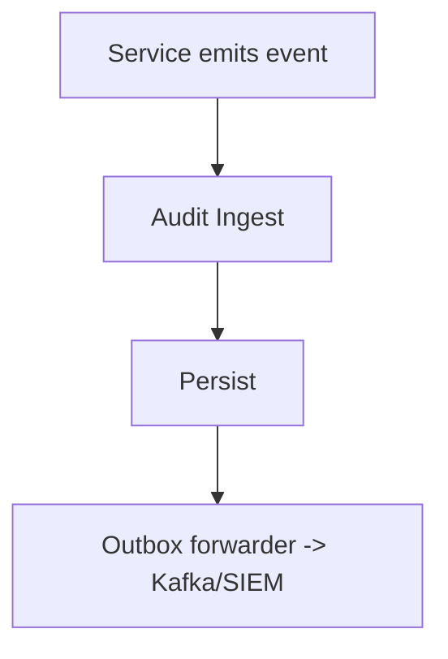

**Audit Service — Focused Mind Map**

- **Responsibility**: Ingest structured events, persist/index, forward to outbox (SIEM/data lake/Kafka), real‑time streaming for monitoring, query APIs.

- **Key endpoints / topics**:
  - `POST /v1/audit/events` — ingest event
  - Outbox forwarder to Kafka/SIEM
  - Query: `GET /v1/events?service=...&correlation_id=...`

- **Ingestion guarantees & retention**:
  - At‑least‑once ingestion; use outbox forwarder for durability.
  - Retention: 90 days hot, archive afterward.

- **Event model (example)**

```json
{
  "event_id":"evt-1",
  "service":"ice",
  "type":"ingress_validated",
  "correlation_id":"abc123",
  "payload":{...},
  "ts":"2026-02-11T09:22:00Z"
}
```

- **Mermaid flow**:



- **Operational notes**:
  - Provide streaming endpoints for real‑time dashboards.
  - Emit high‑severity alerts for failed forwards or large error rates.
