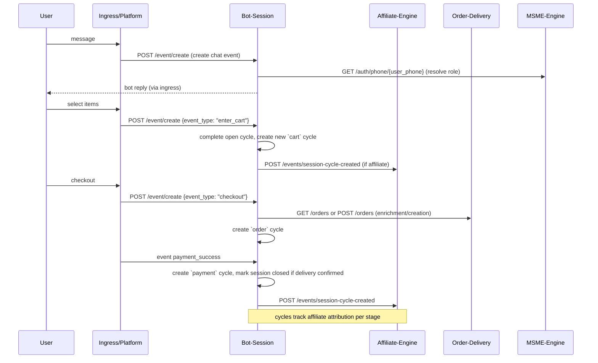

````markdown
**Bot-Session Service — Focused Mind Map**

- **Responsibility**: Manage user ↔ bot conversational sessions, track logical session states (chat → cart → order → payment → delivery → closed), record per-stage attribution via `SessionStateCycle`, and emit events for downstream systems (affiliate, order-delivery, notifications).

- **Outbox-first integration**: persist `session_cycle_created` and session lifecycle intents to the local Outbox in the same transaction as cycle writes; rely on the OutboxDispatcher for resilient delivery (see docs/mind-maps/outbox-integration.md).

- **Key endpoints**:
  - `POST /bot/create` — register a bot
  - `GET /bot/by-phone/{phone}` — lookup bot
  - `POST /session/create` — create or reactivate session
  - `GET /session/resolve` — resolve or create session for phone+bot+platform
  - `GET /session/{session_id}` — basic session info
  - `POST /session/{session_id}/transition` — strict state transition (validated)
  - `GET /session/{session_id}/context` — get structured object_context
  - `PATCH /session/{session_id}/context` — merge updates into current state's context
  - `POST /session/{session_id}/close` — close session and complete cycles
  - `GET /session/{session_id}/cycles` — list session cycles
  - `POST /session/{session_id}/cycle/{cycle_id}/upgrade` — upgrade a specific open cycle
  - `POST /event/create` — create event, may trigger state transitions
  - `PUT /event/{event_id}/update` — update event fields/status
  - `GET /event/{event_id}` — fetch event
  - `GET /event/session/{session_id}` — events for session
  - `GET /event/phone/{user_phone}` — events by phone
  - `GET /admin/session/{session_id}/full` — admin-only: session + cycles + events + cross-service enrichment

- **State model & valid transitions (enforced)**:
  - `chat` → `cart`
  - `cart` → `order` or back to `chat`
  - `order` → `payment` or back to `cart`
  - `payment` → `delivery` or back to `order`
  - `delivery` → `closed`

- **Transition validation (examples)**:
  - `chat`→`cart`: requires `selected_items` in `context`
  - `cart`→`order`: requires `cart_summary`
  - `order`→`payment`: requires `fulfillment`, `contact`, `order_total`
  - `payment`→`delivery`: requires `payment_status = success` and `transaction_id`
  - `delivery`→`closed`: requires `delivery_status = confirmed`, `delivery_code`, `order_id`, `payment_id`

- **Session / Cycle / Event simplified models (example)**

```json
{
  "Session": {
    "id":"sess-123",
    "user_phone":"+2547...",
    "bot_id":"bot-1",
    "platform":"whatsapp",
    "state":"chat",
    "session_mode":"public|registered|staff|customer",
    "status":"active|closed",
    "object_context": {"chat": {...}, "cart": {...}},
    "last_event_id":"ev-99"
  }
}
```

```json
{
  "SessionStateCycle": {
    "id":"cycle-1",
    "session_id":"sess-123",
    "cycle_state":"cart",
    "started_at":"...",
    "completed_at":null,
    "initiated_by_affiliate":true,
    "affiliate_id":"aff-11",
    "meta":{"context":{...}, "affiliate_metadata":{...}}
  }
}
```

```json
{
  "Event": {
    "id":"ev-99",
    "session_id":"sess-123",
    "event_type":"add_to_cart",
    "payload_events": {"items":[...]},
    "message_count":2,
    "previous_turns":{...}
  }
}
```

- **Mermaid sequence (typical flow)**



- **Affiliate integration**:
  - When a cycle is created and `initiated_by_affiliate=true` and `affiliate_id` present, Bot-Session sends a POST to `AFFILIATE_ENGINE_BASE_URL/events/session-cycle-created` with payload containing `cycle_id`, `session_id`, `affiliate_id`, `cycle_state`, `meta`, and `user_phone`.
  - Headers: `X-Correlation-Id: <cycle_id>`, optional `X-Idempotency-Key` set from originating `event_id`.

- **Cross-service enrichment**:
  - Admin endpoint (`/admin/session/{session_id}/full`) fetches deliveries/orders from `ORDER_DELIVERY_BASE_URL`.
  - Session resolution calls `MSME_ENGINE_URL/auth/phone/{phone}` to infer `role` and set `session_mode`.

- **Event creation behavior**:
  - `POST /event/create` will attempt a DB row lock and transactional update to avoid race conditions.
  - It builds `previous_turns` chain (last, t2, t3) and increments `message_count`.
  - Certain `event_type` values map to state transitions: `enter_cart`, `add_to_cart` → `cart`; `checkout` → `order`; `payment_initiated|payment_success` → `payment`; `delivery_initiated` → `delivery`; `delivery_confirmed` → `closed`.

- **Sample request — create session**

```json
POST /session/create
{
  "user_phone":"+2547...",
  "bot_phone":"+2541...",
  "platform":"whatsapp",
  "affiliate_id":"aff-11",
  "affiliate_metadata": {"context": {"user_text":"hi"}}
}
```

- **Sample request — create event (enter cart)**

```json
POST /event/create
{
  "session_id":"sess-123",
  "bot_id":"bot-1",
  "event_type":"enter_cart",
  "payload_events": {"selected_items":[{"product_id":"p1","qty":2}]}
}
```

- **Operational notes**:
  - Emit audit events for session create/reactivate, state transitions, event create, cycle upgrades and session close.
  - Record `SessionStateCycle` per logical stage to ensure affiliate attribution is tied to stage lifecycle.
  - Use DB-level locks when possible; fall back to optimistic commit with retries on StaleDataError.
  - Tests exercise session resolve/create, event flows and cycle attribution.

**S2S Workflows & Automation**

- **Transport & Reliability**: Write all outbound S2S intents to the local Outbox table and let the OutboxDispatcher deliver events to other services; best-effort synchronous delivery may be attempted but MUST not be the sole delivery path for attribution/financial signals.

- **Events Bot-Session Emits**:
  - `session_cycle_created` (hint-only): emitted when a new `SessionStateCycle` is created and `initiated_by_affiliate=true`. Payload must include `cycle_id`, `session_id`, `affiliate_id`, `cycle_state`, minimal `meta`, and `user_phone`.
  - Do NOT emit `delivery_confirmed` as the authoritative paid-attribution signal — that is the responsibility of `order-delivery`. Bot-Session cycles are supplemental hints only.

- **Headers & Correlation**: Outgoing dispatches MUST include `X-Correlation-Id: <cycle_id>` and, when available, `X-Idempotency-Key` (originating `event_id`) in the HTTP headers. Outbox records should store correlation and idempotency keys for retries.

- **Authentication**: Use the internal S2S auth mechanism (short-lived JWT with `business_id`, `role`, `sub` claims or `X-Internal-Secret` per environment) for dispatcher deliveries. Tokens should follow the project's S2S claims contract.

- **Idempotency & Dedup**: Receiving services must treat `session_cycle_created` as idempotent using `X-Idempotency-Key` or `cycle_id`. OutboxDispatcher must persist attempt metadata (attempts, last_error) and support exponential retry with backoff.

- **Affiliate Attribution Contract**: Bot-Session provides affiliative context (affiliate_id, affiliate_metadata) but does not mark paid attribution; downstream `order-delivery` will emit `delivery_confirmed` which affiliate-engine uses as the authoritative paid attribution event. Bot-Session hints are used only for performance/early-signal scoring.


````
