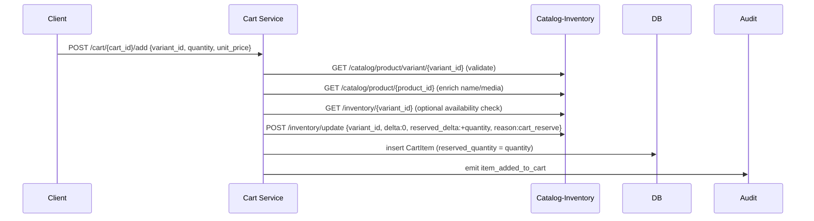
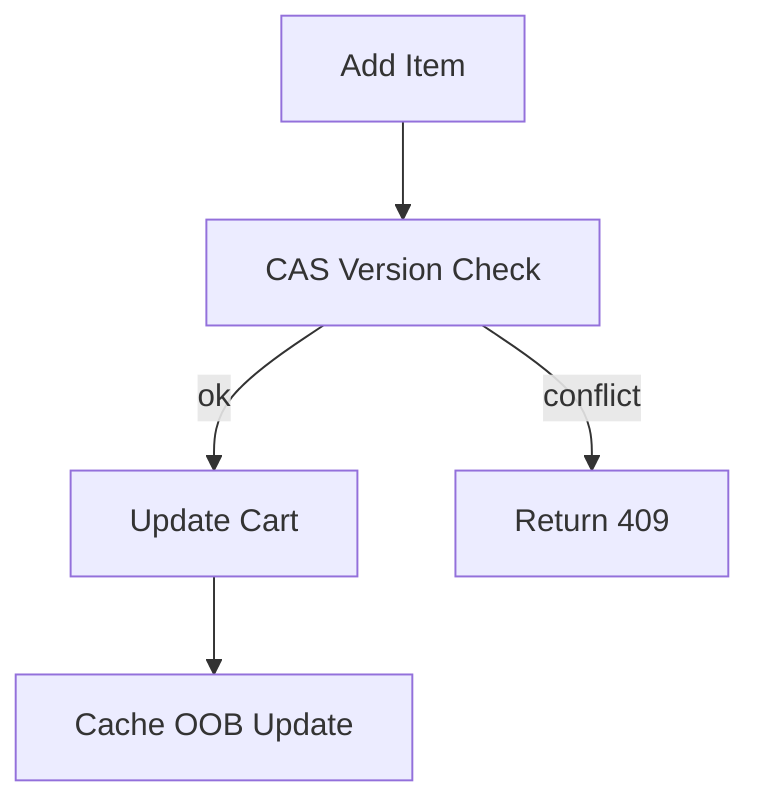

````markdown
**Cart Service — Focused Mind Map**

- **Responsibility**: manage user carts and line items, coordinate inventory reservations with `catalog-inventory`, emit outbox events for downstream order processing, and provide audit/notification hooks.

- **Outbox-first integration**: enqueue `cart.*` intents to the local Outbox during checkout and mutation operations; rely on OutboxDispatcher to deliver `cart.checked_out` and related events (see docs/mind-maps/outbox-integration.md).

- **Key endpoints**:
  - `POST /cart/create` — create cart for session/user
  - `POST /cart/{cart_id}/add` — add an item (validates variant/product, reserves inventory)
  - `PUT /cart/{cart_id}/update` — adjust quantity (adjusts reservation)
  - `DELETE /cart/{cart_id}/remove/{item_id}` — remove item (releases reservation)
  - `GET /cart/session/{session_id}` — list carts for session
  - `GET /cart/user/{user_phone}` — list carts for user
  - `POST /cart/{cart_id}/checkout` — confirm checkout, decrement stock, release reservations, enqueue outbox event

- **Integration surface**:
  - Calls `catalog-inventory` for variant/product details (`/catalog/product/variant/{variant_id}`, `/catalog/product/{product_id}`) to enrich cart items.
  - Reads inventory via `GET /inventory/{variant_id}` and updates inventory via `POST /inventory/update` (reserve, release, decrement).
  - Emits outbox event `cart.checked_out` on checkout via `events.add_outbox_event` for order delivery/payment pipelines.

- **Add item flow (POST /cart/{cart_id}/add)**:



- **Update item flow (PUT /cart/{cart_id}/update)**:
  - Compute `diff = new_quantity - old_quantity`.
  - If `diff != 0`, call `POST /inventory/update` with `reserved_delta = diff` to adjust reservation.
  - Update DB record `quantity`, `reserved_quantity`, `subtotal`.

- **Remove item flow (DELETE /cart/{cart_id}/remove/{item_id})**:
  - If `reserved_quantity > 0`, call `POST /inventory/update` with `reserved_delta = -reserved_quantity` to release.
  - Delete item and emit `item_removed_from_cart` audit event.

- **Checkout flow (POST /cart/{cart_id}/checkout)**:
  - Validate cart exists and has items.
  - For each item:
    - If `quantity > reserved_quantity`, call inventory update to reserve missing quantity.
    - Call inventory update with `delta = -quantity`, `reserved_delta = -quantity` to decrement stock and release reservation atomically.
  - Mark `cart.status = checked_out` and commit.
  - Enqueue `cart.checked_out` outbox event with cart items and total.
  - Notify user (in-app) and emit audit event.

- **Error & idempotency handling**:
  - Critical operations (create, add) are wrapped with `idempotent_execute` and honour `X-Idempotency-Key` headers.
  - Inventory service uses `409` for insufficient stock or reserve violations; cart propagates this as `409 insufficient_stock` to callers.
  - Inventory updates use a separate idempotency key for reservation steps when `X-Idempotency-Key` is present (e.g., `key:reserve`).

- **Tracing & correlation**:
  - Middleware generates `X-Correlation-Id` for requests and propagates it to downstream `catalog-inventory` calls and outbox events.

- **Auth & test shortcuts**:
  - Auth is required by default but cart endpoints are temporarily skipped in middleware for testing via `_AUTH_SKIP_PREFIXES = ['/cart/']`.

- **Outbox & audit**:
  - Cart emits synchronous audit events for all significant actions (`cart_created`, `item_added_to_cart`, `item_removed_from_cart`, `cart_checked_out`).
  - Checkout enqueues `cart.checked_out` outbox event for downstream order creation.

- **Correctness & race considerations**:
  - The service performs local availability checks but treats inventory service as source of truth; race conditions are handled by relying on inventory `POST /inventory/update` enforcement (returns 409 if insufficient).
  - Reservation and decrement sequences are separate API calls; consider strengthening with a single atomic reservation+decrement operation on `catalog-inventory` or multi-step saga with compensations.

- **Testing recommendations**:
  - Unit tests: add item happy path, reserve failure path (simulate `inventory` 409), update quantity adjusting reservation, remove item releases reservation.
  - Integration tests: end-to-end cart add → checkout with mocked `catalog-inventory` and verify outbox `cart.checked_out` payload.
  - Contract tests: ensure `X-Idempotency-Key` semantics for `cart.create` and `cart.add` produce idempotent results.

- **Potential improvements**:
  - Combine reservation + decrement into atomic inventory operation to minimize race windows.
  - Add retry/backoff for transient `catalog-inventory` errors before failing user operations.
  - Add strong validation for `unit_price` vs product price to avoid price tampering (server-side price calculation preferred).

````
**Cart Service — Focused Mind Map**

- **Responsibility**: Manage carts per `cycle_id`/session/user: add/update/remove items, fetch cart, checkout handoff.

- **Key endpoints**:
  - `POST /v1/carts` — create or fetch cart for `cycle_id`
  - `POST /v1/carts/{cart_id}/items` — add item
  - `PATCH /v1/carts/{cart_id}/items/{item_id}` — update qty
  - `DELETE /v1/carts/{cart_id}/items/{item_id}` — remove
  - `POST /v1/carts/{cart_id}/checkout` — checkout (creates order)

- **Concurrency**:
  - Use optimistic CAS / versioning on cart updates. Conflict → return 409 and let caller merge/retry.

- **Limits**:
  - Max 50 line items; max 20 qty per item.

- **Checkout**:
  - On checkout: validate prices with catalog, call Inventory for reservation, then call OrderDelivery to create order.

- **Cart model (example)**

```json
{
  "cart_id":"cart-333",
  "cycle_id":"cycle-999",
  "business_id":"biz-555",
  "user_id":"user-222",
  "items":[ {"item_id":"i1","product_id":"prod-888","variant_id":"v1","qty":2,"price":250} ],
  "status":"open",
  "version": 7
}
```

- **Mermaid flow**:



- **Operational notes**:
  - Emit cart events (`cart:updated`, `cart:checked_out`) for downstream consumers.
  - Track cart size and conflict rates for tuning retries/backoffs.
