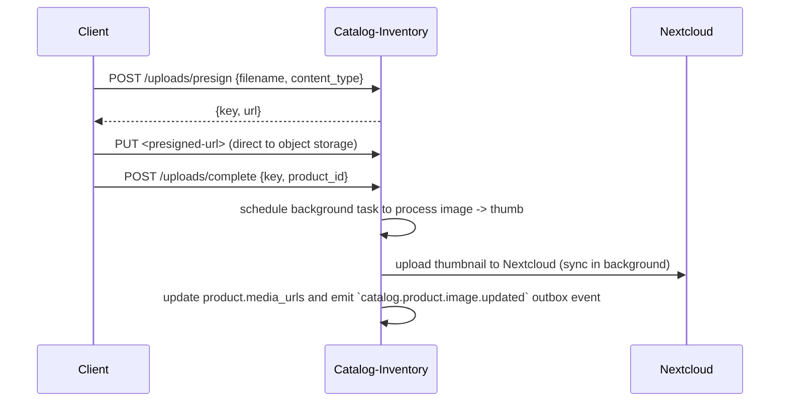
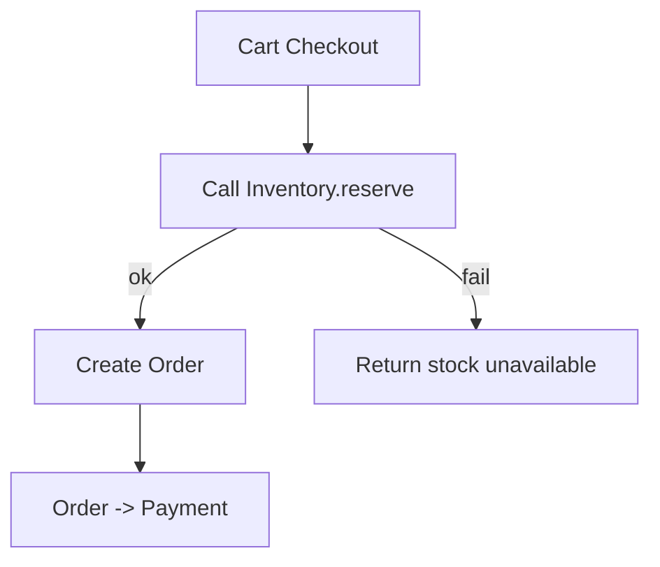

````markdown
**Catalog + Inventory — Focused Mind Map (Uploads, Product, Inventory)**

- **Responsibility**: manage products, variants, media uploads, and inventory levels; emit outbox events for downstream systems; provide presigned upload flow and background media processing.

- **Outbox-first integration**: write `catalog.*` and `inventory.*` events to the local Outbox in the same DB transaction as data writes; rely on OutboxDispatcher for reliable delivery (see docs/mind-maps/outbox-integration.md).

- **Key endpoints (surface)**:
  - `POST /uploads/presign` — return presigned PUT URL for direct client upload
  - `POST /uploads/complete` — notify service upload complete, attach thumbnail to product (background)
  - `POST /catalog/product` — create product (validates MSME business)
  - `PUT /catalog/product/{product_id}` — update product
  - `POST /catalog/product/{product_id}/variant` — add variant (creates inventory row)
  - `POST /inventory/update` — update stock/reserved/threshold for a variant (idempotent)
  - `GET /catalog/business/{business_id}` — fetch products + variants for business

- **High-level flows**:

  - Upload flow (presign + complete):



  - Product/variant lifecycle (create/update):
    - `POST /catalog/product` validates `business_id` via MSME (3 retries/backoff). On success: insert product, emit `catalog.product.created` outbox event, notify in-app and audit-sync.
    - `POST /catalog/product/{id}/variant` inserts variant, creates `Inventory` row (stock=0, reserved=0), emits `catalog.variant.created` and audit.
    - `PUT /catalog/product/{id}` updates fields, emits `catalog.product.updated` outbox event and in-app notification.

  - Inventory update semantics (`POST /inventory/update`):
    - Idempotent via `X-Idempotency-Key` + `idempotent_execute` wrapper.
    - Payload fields: `variant_id`, `delta` (int), optional `reserved_delta`, optional `threshold`, optional `reason`, optional `meta`.
    - Computation:
      - new_stock = current_stock + delta
      - new_reserved = current_reserved + reserved_delta
      - Reject if new_stock < 0 (409 `insufficient_stock`)
      - Reject if new_reserved < 0 (409 `reserved_underflow`)
      - Reject if new_reserved > new_stock (409 `insufficient_stock`)
    - Persist `Inventory.stock_level`, `Inventory.reserved`, `Inventory.threshold`, set `updated_at`.
    - Emits outbox events (best-effort): `inventory.updated`, `inventory.out_of_stock` (stock==0), `inventory.restocked` (old_stock==0 -> stock>0), `inventory.low_stock` (stock <= threshold).
    - Notifies business (in-app) using `inventory_updated` template and emits audit event synchronously.

- **Operational details & patterns observed**:
  - Correlation: middleware generates/propagates `X-Correlation-Id` for tracing; outbox events include correlation_id when available.
  - Idempotency: `idempotent_execute` wrapper is used for key endpoints (product/category/variant/inventory) guarded by `X-Idempotency-Key` header.
  - MSME validation: product create calls MSME `/business/{id}` with retry/backoff; 404 -> `business_not_found`, 5xx -> upstream error.
  - Outbox: all entity changes add outbox events for reliable downstream delivery.
  - Media: presign + client direct upload pattern; `uploads/complete` triggers background thumbnail processing and Nextcloud upload (synchronous call in background task). Current code uses a brief sleep-like wait in the attach task — consider replacing with explicit processing-complete event or polling of processing job status.
  - Auth: access token required for most routes; media endpoints and some read endpoints temporarily skip auth by prefix.

- **Constraints & correctness checks**:
  - Inventory update prevents oversell by enforcing reserved <= stock and stock >= 0.
  - Variant creation ensures an `Inventory` row exists to avoid missing inventory records downstream.
  - Product image attach uses presigned GET URL for `image_url` stored on product after processing — ensure GET URLs are time-bounded or replaced with CDN-backed stable URLs if required.

- **Testing recommendations**:
  - Unit tests: `inventory_update` edge cases (delta underflow, reserved underflow, reserve > stock), variant creation creates inventory row.
  - Integration tests: presign + complete flow with mock Nextcloud; verify `catalog.product.image.updated` outbox event and DB update.
  - Contract tests: idempotency behavior for `POST /inventory/update` with repeated `X-Idempotency-Key`.

- **Potential improvements to consider**:
  - Replace background sleep/wait attach flow with a processing queue and explicit `upload.processed` event to avoid race conditions.
  - Validate `meta` contents on outbox events for size and sensitive data before dispatch.
  - Add strong typing/limits for `reserved_delta` and `delta` to prevent large accidental updates.

````
**Catalog & Inventory — Focused Mind Map**

- **Responsibility**: Serve product catalogs, snapshots, manage inventory counts and reservations.

- **Key endpoints**:
  - `GET /v1/businesses/{biz}/products/{product_id}/snapshot`
  - `GET /v1/businesses/{biz}/products` — list
  - `POST /v1/inventory/{variant_id}/adjust` — update counts
  - `POST /v1/inventory/{variant_id}/reserve` — create reservation (used by checkout flow)
  - `POST /v1/inventory/{variant_id}/release` — release reservation

- **Inventory strategy**:
  - Reserve at checkout (optimistic hold) — 15 minute hold.
  - Reservation mechanism: decrement available stock immediately and write a reservation record with expiry.
  - If reservation expiry passes and not captured, auto-release and increment available stock.

- **Product snapshot model (example)**

```json
{
  "product_id":"prod-888",
  "name":"Shoes",
  "price":250,
  "currency":"ZMW",
  "variants":[ {"variant_id":"v1","sku":"SKU-1","stock":10} ]
}
```

- **Mermaid flow**:



- **Operational notes**:
  - Support reindexing and bulk updates (scripts exist in `scripts/`).
  - Keep product snapshots cached in ICE/OOB for read performance; source-of-truth is Catalog service DB.
