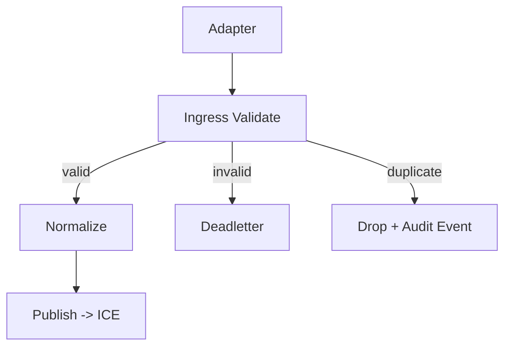

**Ingress — Focused Mind Map**

- **Responsibility**: Validate adapter messages, enforce idempotence and normalization, and forward validated payloads to ICE for hydration and authoritative processing.

- **Inputs**:
  - Source adapters (WhatsApp/SMS/HTTP) produce `incoming:message` records.
  - Required fields: `request_id`, `to`, `from`, `meta.platform`.

- **Behavior / policies**:
  - Validate payload schema; return 400 on missing required fields.
  - Normalize phone numbers and platform identifiers to canonical forms.
  - Enforce idempotence using `request_id` (primary) and accept `X-Idempotency-Key` when provided.
  - Attach `X-Correlation-Id` (generate if absent) and propagate it downstream.

- **Forwarding / integration**:
  - Forward validated payload to ICE `POST /api/v1/hydrate/session` with `request_id` as correlation/idempotency key.
  - Prefer async publish to message lane (e.g., `bot:lane:{bot_type}`) when high throughput; for cache-miss hydration call ICE directly.
  - Do NOT perform business or affiliate resolution locally — delegate authoritative lookups to ICE (MSME adapter calls should be centralized in ICE).

- **Retries & failures**:
  - On transient errors calling ICE, retry with exponential backoff (3 attempts) and then move to `ingress:deadletter` with full payload and error reason.
  - Metrics: `ingress.requests_total`, `ingress.invalid`, `ingress.deadletter_count`.

- **Auditing & observability**:
  - Emit minimal audit event `ingress.received` (non-authoritative) to an audit sink or local Outbox for audit ingestion.
  - Include `request_id`, `correlation_id`, ingress source, and validation result.

- **Security**:
  - Validate incoming adapter-provided signatures where available (provider HMAC or platform signature); drop obviously malicious payloads.

-- End
**Ingress Service — Focused Mind Map**

- **Responsibility**: Accept adapter payloads (`incoming:message`), validate, deduplicate, normalize, forward to ICE.
- **Key endpoints / topics**:
  - Input: `incoming:message` (message broker)
  - Output: `ice:ingest` or direct HTTP POST to ICE `/v1/ingest`
  - Deadletter: `ingress:deadletter`

- **Validation rules**:
  - Required: `request_id`, `to`, `from`, `meta.platform`.
  - Idempotence key: `request_id` only; window 30 minutes.
  - Phone normalization: Country‑code only (no `+`); normalize to digits-only e.g., `260955000111`.
  - Platform normalization: map incoming values to canonical set: `whatsapp`, `sms`, `telegram`, `web`.

- **Normalization & enrichment**:
  - Standardize `from`/`to` to `260...` format.
  - Ensure `meta.platform` in canonical set.
  - Attach `ingress_validated: true` and `ingress_ts` timestamp.

- **Failure handling**:
  - Validation failure → publish to `ingress:deadletter` (include reason).
  - Duplicate (idempotence) → ack and drop, emit `ingress_duplicate` audit event.

- **Payload example (after ingress validation)**

```json
{
  "request_id": "abc123",
  "to": "260955000111",
  "from": "260977000222",
  "text": "Hi, I want to order shoes",
  "meta": { "platform": "whatsapp", "timestamp": "2026-02-11T09:22:00Z", "ingress_validated": true }
}
```

- **Mermaid flow**:



- **Operational notes**:
  - Keep validation lightweight; complex enrichment belongs to ICE.
  - Log telemetry for latency and validation error rates.
