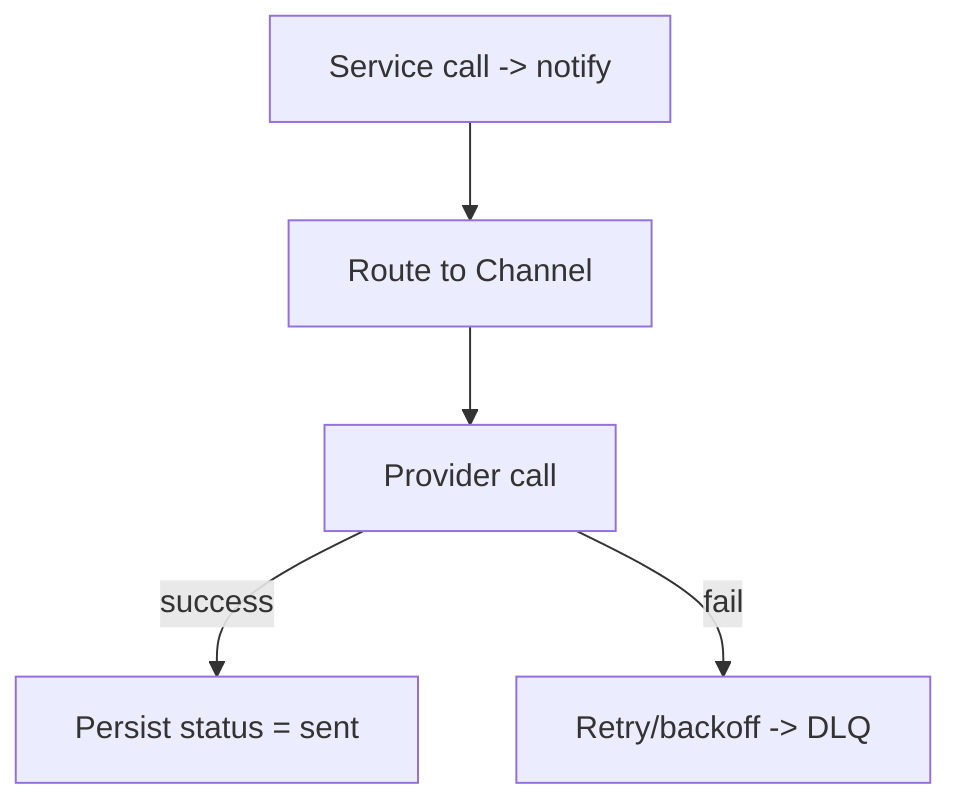

"""markdown
**Notification Service — Focused Mind Map**

- **Responsibility**: centralize sending and delivery tracking for user/business notifications (WhatsApp, Email, Push), provide templating, persistence for audit/retries, channel adapters, and expose a stable S2S API for other services.

- **Outbox-first integration**: accept Outbox-delivered notification intents from other services as a primary integration mode; write any local sends to Outbox for audit and downstream visibility (see docs/mind-maps/outbox-integration.md).

- **Primary endpoints**:
  - `POST /v1/notifications/send` — enqueue/send a notification (idempotent)
    - Payload: `{ "recipient": {"phone"?, "email"?, "user_id"?}, "channel": "whatsapp|email|push", "template": "template_key", "template_vars": {...}, "metadata": {...} }`
    - Headers: `X-Correlation-Id`, `Authorization` (S2S), optional `X-Idempotency-Key` / `event_id`
    - Behaviour: persist a `Notification` row, attempt send (async worker), return 202 with persisted `notification_id`.
  - `GET /v1/notifications/{id}` — fetch notification record and status
  - `GET /v1/notifications?recipient=...` — query recent notifications for a recipient
  - Admin: `GET /v1/admin/notifications/pending`, `POST /v1/admin/notifications/{id}/retry`

- **Event & DB model (simplified)**:
  - Notification: `{ id, recipient, channel, template, template_vars, metadata, status: queued|sending|sent|failed, attempts, error, created_at, sent_at }`

- **Delivery model & guarantees**:
  - Persistent: store notifications durably and drive sends via background workers. Do not depend on synchronous upstream calls for guaranteed delivery.
  - Idempotency: respect `X-Idempotency-Key` or `event_id`: repeated calls return the original `notification_id` and do not resend unless admin forces retry.
  - Retries: exponential backoff with capped attempts (configurable, e.g., 5), then move to DLQ with error recorded.
  - Delivery receipts: record provider delivery callbacks (if available) as `notification.receipt` rows and emit Outbox events `notification.delivery_receipt` for downstream consumers if configured.

- **Templating & localization**:
  - Store templates by key with optional localization. Templates accept `template_vars` and are rendered server-side using a safe templating engine (e.g., Jinja2 restricted or equivalent).
  - Support channel-specific templates (e.g., `welcome_sms`, `welcome_whatsapp`) and a template fallback chain.

- **Channels & provider adapters**:
  - Pluggable adapters for prioritized channels: `whatsapp`, `email`, `push`. Keep provider credentials per-env and per-channel.
  - Provider preferences: e.g., WhatsApp via approved provider adapter, Email via SMTP/Sendgrid, Push via FCM/APNS adapters.
  - Implement rate-limiting per-provider and per-business to avoid throttling or abuse.

- **Auth & S2S**:
  - Require short-lived JWTs for S2S calls by default. Tokens must include `business_id`, `role`, and `sub` claims. `X-Internal-Secret` may be accepted for internal admin tooling only.
  - Validate and require `X-Correlation-Id` on all critical flows; reject requests without it.

- **Integration patterns (recommended canonical choices)**:
 1. Outbox-first (recommended for all critical flows): upstream service writes a Notification intent row to its local Outbox and the OutboxDispatcher delivers to Notification Service. This ensures reliability, consistent retries, and traceability.
 2. Direct S2S (acceptable for non-critical/interactive flows): upstream service calls `POST /v1/notifications/send` directly; Notification returns 202 and sends asynchronously. Require `X-Idempotency-Key` for safety.

- **Existing codebase notes (observed)**:
  - `MSME` currently proxies to notification via `get_notification_base_url()` and `_notify_in_app()` which performs an HTTP post; this is best-effort and does not replace Outbox guarantees.
  - Repo contains `services/notification/dev_notifications.json` referenced by utility scripts for local dev storage — adopt similar persistent model in production DB.

- **Observability & tracing**:
  - Propagate `X-Correlation-Id` across calls and record it on persisted notification rows.
  - Emit Outbox events for `notification.sent` and `notification.delivery_receipt` for other services to consume (analytics, affiliate_engine hints, audit). `notification.delivery_receipt` MUST be published so downstream services can act on delivery receipts.

- **Admin & developer UX**:
  - Provide a dev JSON storage fallback (already referenced) for local testing.
  - Provide admin retry endpoints, per-business send quotas, and recent-send search.

- **Operational concerns**:
  - Ensure templates do not leak PII; sanitize `template_vars` and audit content.
  - Provide a DLQ and manual reprocess flow for failed notifications.
  - Track provider-level usage and budgets; alert on high failure rates.

"""
**Notification Service — Focused Mind Map**

- **Responsibility**: Deliver notifications across channels (WhatsApp, Email, In‑app), store statuses, provide query APIs.

- **Key endpoints**:
  - `POST /v1/notify` — send notification
  - `GET /v1/notifications/{id}` — status
  - `GET /v1/notifications?user={phone}`

- **Routing**:
  - Channel selection by callers. Channels: `whatsapp` (provider), `email` (SMTP), `in_app` (DB store).
  - Transactional notifications (payment, delivery) are high priority; aggressive retry/backoff and tracking.

- **Retry strategy**:
  - Exponential backoff; push to DLQ after N retries. Track attempts and status.

- **Notification model (example)**

```json
{
  "notification_id":"not-1",
  "to":"260955000111",
  "channel":"whatsapp",
  "payload":{"text":"Your order is confirmed"},
  "status":"sent",
  "attempts":1
}
```

- **Mermaid flow**:



- **Operational notes**:
  - Instrument end-to-end latency and provider errors.
  - For WhatsApp, track message IDs for reconciliation.
