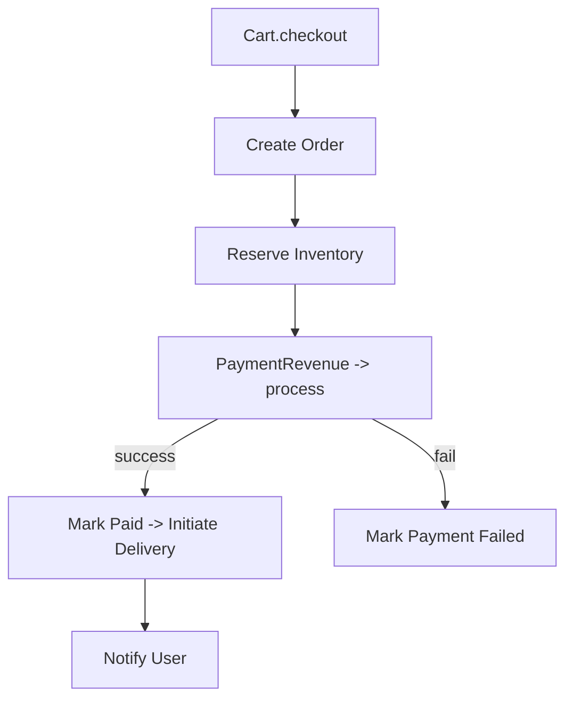

````markdown
**Order + Delivery — Focused Mind Map**

- **Responsibility**: manage orders, payment initiation/receipt, delivery lifecycle (code generation + confirmation), emit outbox events (`order_created`, `order_paid`, `order_delivered`, `delivery_confirmed`) and forward affiliate attribution when available.

- **Outbox-first integration**: write `order.*` and `delivery.*` events to the local Outbox as part of the order/delivery transaction; OutboxDispatcher will deliver authoritative `delivery_confirmed` to `affiliate-engine` and other sinks (see docs/mind-maps/outbox-integration.md).

- **Key endpoints**:
  - `POST /orders/create` — create order; calculates platform fee, emits `order_created` outbox event (with affiliate metadata if present)
  - `POST /orders/{order_id}/mark_paid` — mark order paid (idempotentizable via outbox event)
  - `POST /orders/{order_id}/initiate_payment` — calls `payment-revenue` to initiate external payment
  - `POST /delivery/initiate/{order_id}` — generate delivery code (salt+hash stored), emit `delivery_code_generated`
  - `POST /delivery/{delivery_id}/confirm` — verify code, mark delivery confirmed, emit `delivery_confirmed` and `order_delivered` events
  - `GET /delivery/order/{order_id}` — fetch delivery attached to an order
  - `GET /orders/pending` & `GET /deliveries/pending` — admin/MSME dashboards

- **Order creation flow**:
  - Validate business and compute `platform_fee_amount`, `transaction_fee_pct`, `msme_net_amount` (via MSME entitlements endpoint with backoff fallback).
  - Persist `Order(status=pending_payment)` and create an `OutboxEvent(event_type=order_created)` carrying `event_id`, `affiliate_code`/`affiliate_id` (attempt to enrich from `session_id` via Bot-Session cycles if not present in meta).
  - Best-effort immediate HTTP POST to `affiliate-engine` when `affiliate_code` available; mark outbox processed if affiliate accepts.
  - Notify user (in-app) and emit audit event.

- **Payment flow**:
  - `POST /orders/{order_id}/initiate_payment` delegates to `payment-revenue` (`/pawapay/deposits/initiate`) and returns provider status. Audits `payment_initiated`.
  - `POST /orders/{order_id}/mark_paid` is callable without bearer token (skips auth for this path); sets `order.status=paid`, computes fees (if missing), emits `order_paid` outbox event, notifies user and audit.
  - Payment-revenue or custom webhook callers should call `mark_paid` to signal paid state (idempotent by route semantics).

- **Delivery lifecycle**:
  - `delivery/initiate`: only allowed for `order.status == paid`; generates a 6-digit code and stores only a salted hash (`delivery_code_salt`, `delivery_code_hash`) to avoid leaking codes; initial `status = code_sent`; emits `delivery_code_generated` outbox event and in-app user notification including the plain `delivery_code` (returned to caller once at creation time).
  - If delivery already exists, endpoint returns `delivery` and masked `delivery_code` for idempotency callers.
  - `delivery/{delivery_id}/confirm`: client supplies `delivery_code`; service verifies code (supports legacy cleartext or salt/hash), sets `delivery.status = confirmed`, sets `order.status = delivered` (if not already), emits `delivery_confirmed` and `order_delivered` outbox events (the latter includes `event_id` and affiliate fields), notifies user and business, and emits audit event.

- **Outbox & affiliate handling**:
  - All important state changes emit `OutboxEvent` records; `outbox_dispatcher` runs as background task on startup when enabled.
  - Affiliate attribution: order creation and delivery confirmation attempt to include `affiliate_code`/`affiliate_id` in outbox payloads so affiliate-engine can process them; immediate best-effort dispatch is performed for `order_created`.

- **Security & auth model**:
  - Middleware requires bearer tokens except for health/metrics/docs and the `mark_paid` callback path.
  - Internal callers can bypass via `X-Internal-Secret` header when configured.
  - Business-level actions (e.g., `GET /orders/pending`, `POST /orders/{order_id}/confirm`) validate token role or `business_id` match via `_authorize_business_access`.

- **Delivery code design**:
  - 6-digit numeric code generated and stored as salted SHA-256 hash. On `initiate`, only the first response returns the plain code; subsequent callers receive masked code.
  - Verification accepts existing cleartext storage for backward compatibility.

- **Observability & traceability**:
  - Uses correlation IDs (`X-Correlation-Id`) propagated to affiliate, bot-session, payment-revenue and notifications.
  - Audit events emitted for order/delivery/payment actions.

- **Failure modes & correctness checks**:
  - Fee calculation relies on MSME entitlements; missing data falls back to safe defaults (700 bps).
  - `mark_paid` is unauthenticated by design (webhook style) — ensure callers present correlation/idempotency headers to prevent duplication.
  - Outbox ensures eventual delivery of `order_created`, `order_paid`, `order_delivered`, and `delivery_confirmed` events.

- **Testing recommendations**:
  - Unit tests: `order_create` fee calculation branches, `mark_paid` idempotency, `delivery_initiate` code generation uniqueness, `delivery_confirm` code verification (salted and legacy cleartext).
  - Integration tests: end-to-end order -> initiate_payment (mock payment-revenue) -> mark_paid webhook -> initiate_delivery -> confirm delivery (verify outbox `order_delivered` payload includes affiliate fields when present).
  - Security tests: ensure `POST /orders/{order_id}/mark_paid` behaves idempotently when called repeatedly and logs correlation ids.

- **Potential improvements**:
  - Consider stronger idempotency for `mark_paid` (require `X-Idempotency-Key` or `event_id` in payload) to avoid accidental double-processing.
  - Make delivery code length configurable or use time-bound OTPs for higher security.
  - Add a dedicated `order.payment_status` subresource with event audit trail for partial payments/refunds.

**S2S Workflows & Automation (Order-Delivery)**

- **Authoritative paid-attribution**: `order-delivery` is the authoritative emitter of `delivery_confirmed` and `order_delivered`. These events are the single source of truth for paid attribution consumed by `affiliate-engine`.
- **Outbox usage**: Write `delivery_confirmed` and `order_delivered` to the Outbox and let the OutboxDispatcher reliably deliver them to `affiliate-engine` and other consumers. Include `event_id`, `order_id`, `affiliate_id`/`affiliate_code`, `business_id`, `total_amount`, `currency`, and `correlation_id` in the payload.
- **Idempotency & headers**: Require `X-Idempotency-Key` (or `event_id`) on incoming payment/callback handlers and include the same keys in outgoing outbox messages. Always propagate `X-Correlation-Id` for tracing.
- **Best-effort enrichments**: If `affiliate_id` is missing on order creation, `order-delivery` may best-effort enrich from `bot-session` cycles before emitting outbox events, but enrichment must not block emission.
- **Consumption contract**: `affiliate-engine` will only credit payouts when it receives `delivery_confirmed` (or equivalent `order_delivered`) from Outbox; `order_created`/`order_paid` are optional and used for dashboarding only.

````
**Order & Delivery — Focused Mind Map**

- **Responsibility**: Create orders from carts, handle payment handoff, track delivery lifecycle, confirm deliveries.

- **Key endpoints**:
  - `POST /v1/orders` — create order (called by Cart.checkout / ICE)
  - `GET /v1/orders/{order_id}` — fetch
  - `POST /v1/orders/{order_id}/payment_callback` — payment provider callback
  - `POST /v1/orders/{order_id}/deliver` — initiate delivery
  - `POST /v1/orders/{order_id}/confirm_delivery` — confirm via OTP/code

- **Flow rules**:
  - Validate cart and inventory before creating order.
  - On order create, set `status: pending_payment` and send payment request to PaymentRevenue.
  - On payment success callback, mark order `paid`, then initiate delivery and emit affiliate event if affiliate_id present.

- **Order model (example)**

```json
{
  "order_id":"ORD-123",
  "cart_id":"cart-333",
  "business_id":"biz-555",
  "user_phone":"260955000111",
  "items":[{"product_id":"prod-888","qty":2}],
  "subtotal":500,
  "status":"pending_payment",
  "affiliate_id":"aff-123"
}
```

- **Mermaid flow**:



- **Operational notes**:
  - Ensure idempotent order creation using `cart_id` or `request_id`.
  - Track delivery timeouts and retries; provide admin tools for manual interventions.
