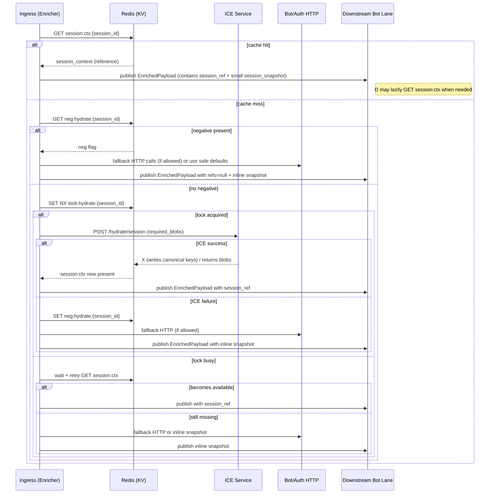

# Ingress Cache-Reference Contract

This document specifies which fields in the `EnrichedPayload` are _references_ (keys) versus embedded JSON, the minimal inline snapshot required for immediate routing, canonical Redis key names and suggested TTLs, and the cache-miss behavior the ingress service implements.

## 1) Reference vs Embedded
- Reference fields: include only a canonical Redis key + id + schema_version + small inline snapshot. Consumers should dereference the key when they need the full JSONB.
- Embedded fields: small, frequently-changing or message-scoped data that must travel with the event (e.g., normalized_text, attachments, tiny session snapshot used for routing).

Typical `meta` structure (recommended):

```
meta:
  platform: "wa"
  bot_ref: {
    key: "bot:core:{bot_id}",
    id: "bot_id",
    schema_version: "v1",
    snapshot: { bot_type, primary_lane }
  }
  business_ref: { key: "bot:owner:{owner_id}", id, schema_version }
  session_ref: {
    key: "session:ctx:{session_id}",
    id: "session_id",
    schema_version: "v1",
    snapshot: { session_mode }
  }
  session_snapshot: { session_id, started_at, last_active_at }  # small inline
```

Notes:
- `session_snapshot` is small and required for immediate routing and metrics even if `session_ref` is present.
- Avoid embedding full JSONB blobs (bot config, templates, product snapshots) inside `EnrichedPayload`.

## 2) Canonical key names (examples)
- Bot: `bot:core:{bot_id}`
- Bot owner/profile: `bot:owner:{owner_id}`
- Bot config: `bot:config:{bot_id}`
- Bot routing: `bot:routing:{bot_id}`
- Catalog index: `bot:catalog:index:{business_id}`
- Product snapshot: `bot:catalog:product:{product_id}`
- User profile: `user:profile:{user_id}`
- User by phone: `user:by_phone:{business_id}:{phone}` (or `user:by_phone::{phone}` when no business)
- Session snapshot: `session:snapshot:{session_id}`
- Session context (hydrated): `session:ctx:{session_id}`
- Hydration lock: `lock:hydrate:{session_id}`
- Negative cache: `neg:hydrate:{session_id}`

These match the helpers in `app/services/keys.py` and the Redis key patterns described in the JSONB examples docs.

## 3) Suggested TTLs (guide)
- `bot:core:{bot_id}`: 5–30 minutes
- `bot:owner:{owner_id}`: 6–24 hours
- `bot:catalog:index:{business_id}`: 30–120 minutes
- `bot:catalog:product:{product_id}`: 1–10 minutes
- `bot:config:{bot_id}` / `bot:routing:{bot_id}` / `bot:policy:{bot_id}`: 1–6 hours
- `session:ctx:{session_id}`: 10–30 minutes
- `session:snapshot:{session_id}`: 5–30 minutes
- `lock:hydrate:{session_id}`: 10–30 seconds (short-lived)
- `neg:hydrate:{session_id}`: 10–60 seconds

Store TTL configuration in `app/core/config.py` so values are centrally configurable.

## 4) Cache-miss behavior (ingress policy)
1. Enricher checks canonical `session:ctx:{session_id}` then legacy `cache:session_context:{session_id}`.
2. If missing and `INGRESS_HYDRATE_FIRST` is enabled:
   - Check `neg:hydrate:{session_id}`; if present → skip hydrate, use safe defaults.
   - Acquire `lock:hydrate:{session_id}` using SET NX with short TTL.
     - If lock acquired → call ICE `preload_session_context(..., required_blobs=[...])` to obtain required JSONB blobs and write canonical keys into Redis with TTLs.
     - On success → write `session:ctx:{session_id}` and any other canonical bot/user keys returned by ICE.
     - On failure → set `neg:hydrate:{session_id}` for a short time to avoid thundering herd.
     - Always release lock by letting TTL expire (no explicit del required) to avoid unsafe deletes.
   - If lock not acquired → wait briefly and then read cache key again; if still missing and negative set → fallback.
3. If `INGRESS_HYDRATE_FIRST` is disabled (legacy mode): optionally call ICE as a fallback (best-effort), but continue enrichment by calling Bot/Auth/Capability HTTP services when `INGRESS_ENRICH_ALLOW_FALLBACK_HTTP=True`.
4. If neither ICE nor HTTP fallbacks are available, use safe defaults and small inline snapshots so routing can proceed.

## 5) Dereference strategy (downstream consumers)
- Lazy deref: consumers should prefer lazy deref of referenced keys. Use local caches + TTLs to avoid repeated Redis reads.
- Validation: if consumer requires a specific `schema_version`, validate `schema_version` from the reference before using; if mismatched, trigger a refresh/deref.
- Fallback: if deref fails, apply safe behavior (e.g., route to fallback lane, send a clarifying reply) rather than blocking pipeline.

## 6) Observability and metrics
- Emit these metrics in the ingress service and in consumers:
  - `cache_hit`, `cache_miss`, `hydrate_attempt`, `hydrate_success`, `hydrate_failure`, `negative_cache_set`, `lock_acquired`, `lock_failed`, `dereference_errors`, `jsonb_size_bytes`.
- Record `required_blobs` and `hydrate_latency` for ICE calls.

---

## Sequence diagram: dereference vs inline snapshot



---

Path: `bot-ingress-service/docs/ingress_cache_contract.md`

If you want this merged into `bot_jsonb_examples.md` or exported as an image file, say which option you prefer.
