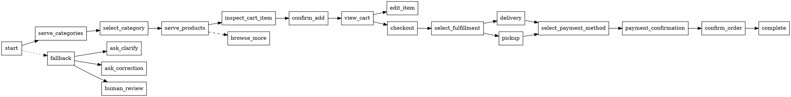

# Custom Bot Service — Architecture

## Purpose

The Custom Bot Service runs the Node Engine and Order Object Builder (OOB). It consumes enriched envelopes from `bot:lane:{bot_type}` (custom), resolves intents (via the Intent Service), executes node handlers that update the OOB, and emits side-effects to Reply/Outbound services. The service focuses on low-latency decisioning, auditability of node executions, and safe OOB mutation.

## State Model

- Session state (Redis): lightweight session context per `session_id` (current_node, last_active_at, flags). Short TTL tied to active conversation.
- Order Object (Redis): canonical in-progress order for session (items, totals, fulfillment, payment_ref, contact, attribution, metadata). OOB is the hot-source for handlers and is written through to ICE for durability/audit.

Metadata on OOB:
- `last_event_id`, `last_node_executed`, `schema_version`, `hydrated_at`, `lock_version` (for optimistic CAS), `audit_stream_ref`.

## Tree / Journey Engine (Node Engine)

- Responsibilities:
	- Inspect `current_node` from the incoming envelope.
	- Load the OOB snapshot for `session_id` (cache-first).
	- Invoke the mapped handler for the node (handler returns a patch, side-effects, next_node suggestion).
	- Apply handler patch atomically to OOB (optimistic CAS or short lock), update `current_event` with `node_executed` and `action_status`.
	- Emit an audit entry (patch + `event_id`) to reconstruct OOB history.

- Handler properties:
	- Pure interface: input (oob_snapshot, event, enriched_meta) -> output (oob_patch, side_effects, node_executed, action_status, diagnostics).
	- Must be idempotent given same `event_id`.

## Inputs

- Stream: `bot:lane:custom` — enriched envelope from Ingress containing `event_id`, `session_id`, `user_id`, `raw.text`, `enriched.session_blob`, `routing_hints`.
- Intent results: synchronous call or `intent:results` response — `{intent, confidence, slots}`.
- Admin / control: handler reloads, schema bumps, config updates.

## Outputs

- Primary: publish the handler outcome to `reply:requests` (including rendered reply hints and OOB snapshot references) for the Reply Service to construct user-facing messages.
- Audit stream: append canonical resolved payload + OOB patch to `oob:audit` or `ingress:resolved_payload` for replay and debugging.
- DLQ: put failed envelopes or unrecoverable OOB states into `custom-bot:dlq` with full diagnostics.

## ICE Interactions

- Cache-first pattern: Node Engine reads OOB from Redis and only calls ICE when authoritative data is required (price lock, stock check, payment validation, merchant rules).
- Hydration: Node Engine may call ICE `POST /hydrate/session` for missing authoritative blobs; ICE returns blobs with `schema_version` and `hydrated_at` which are merged into OOB.
- Side-effects: ICE calls are treated as side-effects; synchronous for blocking operations (checkout confirmation) or async via `ice:preload` for background hydration.

## Failure Handling

- Atomicity: apply OOB patches only after successful validations; use optimistic CAS or short Redis locks to prevent interleaved updates.
- Transient errors: retry ICE calls or publish attempts with exponential backoff; do not apply partial patches unless compensating steps are recorded.
- Permanent validation failures: mark `action_status: fail`, route to corrective node (e.g., `ask_correction`), and log diagnostics.
- Idempotency: check `idempotency:request:{event_id}` to ignore duplicates and return prior outcome where possible.
- DLQ and human review: repeated failures or policy denials must be escalated to `custom-bot:dlq` with full OOB snapshot and event history.

## Observability

- Events to emit (structured JSON): `node_enter`, `node_exit` (includes `node_executed`, `action_status`, duration), `oob_patch_applied`, `ice_call` (latency + result), `oob_snapshot_sample`.
- Metrics:
	- `custombot.node.latency` (histogram) by node name
	- `custombot.handler.failures` (counter)
	- `custombot.ice.hits` / `custombot.ice.misses` (counter)
	- `custombot.oob.conflicts` (counter)
	- `custombot.dlq.count`
- Tracing: propagate `trace_id` from Ingress; create spans for `intent_call`, `handler_exec`, `oob_apply`, and `reply_publish`.
- Audit: append-only OOB patch stream stored in ICE/Postgres for eventual consistency and replay capability.

---

Notes / developer guidance (non-normative):
- Keep handlers small and focused; include clear diagnostics for every non-success outcome.
- Bump `schema_version` when OOB shape changes and provide a migration plan.
- Prefer optimistic apply + validation over long locks; use short locks only for critical sections (e.g., final checkout commit).

## Cart Management Improvements

Purpose: improve guarantees, UX, and scalability for cart operations stored in the OOB (`order_draft` / `cart`).

Data model (OOB cart namespace):
- `cart.items[]` — { product_id, sku, qty, unit_price_snapshot, total_price, meta }
- `cart.totals` — { subtotal, discounts, delivery_fee, tax, grand_total }
- `cart.status` — enum: `building|reserved|locked|checkout_pending|completed|abandoned`
- `cart_version` — monotonic int for optimistic apply
- `last_price_lock_id` — reservation id returned by ICE

Standard handlers (verbs): `add_item`, `update_qty`, `remove_item`, `apply_coupon`, `set_fulfillment`, `start_checkout`, `confirm_payment`, `cancel_reservation`, `preview_totals`.

Concurrency & integrity:
- Use `cart_version` / `lock_version` for optimistic CAS. Node Engine must rehydrate and re-run handler logic on version conflict.
- Handlers return atomic `oob_patch` + `cart_event` containing the post-apply `cart_version` and `compensating_patch` for rollbacks.

Inventory & pricing (ICE integration):
- Two-step pattern: apply local `price_snapshot` immediately for UX, then call ICE `reserve_items` for authoritative reservation during checkout. ICE returns `reservation_id` and TTL; on success set `cart.status=reserved` and `last_price_lock_id`.
- On reservation or price-change failure, handler returns `action_status: fail` with `diagnostics` and Node Engine routes to `ask_correction`.

Durability & recovery:
- Persist OOB patch stream (append-only) to ICE/Postgres for replay. Reconstruct OOB from snapshots + patch stream on restart.
- Abandoned-cart workflow: emit `cart.abandoned` after inactivity TTL; support recovery flows (resume cart) if user returns within retention window.

UX & correction flows:
- Provide `preview_totals` that computes projected totals without changing `cart.status`.
- Correction handlers (`change_qty`, `remove_item`) produce minimal patches and preserve `cart_version` semantics.

Idempotency & retries:
- All external-affecting handlers (reserve, confirm_payment) must be idempotent using `idempotency:request:{event_id}` or `last_action_id` on cart to dedupe retries.

Performance & scale:
- Keep cart in Redis with TTL (extend on activity). Use snapshot refs for heavy blobs (catalog_snapshot_id).
- For merchants with high concurrency, rely on ICE reservations instead of long Redis locks.

Observability:
- Metrics: `cart.add_item.latency`, `cart.reserve.success_rate`, `cart.conflict.rate`, `cart.abandon.rate`, `cart.value.histogram`.
- Emit structured `cart_event` for every cart-affecting action with `event_id`, `session_id`, `action`, `result`, `cart_version`, `reservation_id`.

Testing:
- Unit test handlers with OOB snapshots (happy, conflict, error cases).
- Integration test concurrent add/update/remove with optimistic retry.

---

Add these patterns to handler contracts and the Node Engine implementation as recommended defaults.

## Handler Interface Spec (Input / Output JSON)

Purpose: define the minimal contract every node handler must implement. Handlers MUST NOT mutate OOB directly — they return a patch which the Node Engine applies atomically.

1) Input (handler receives this JSON):

```json
{
	"event_id": "evt_20251226_0001",
	"idempotency_key": "evt_20251226_0001",
	"session_id": "sess_abc123",
	"current_node": "serve_products",
	"user_input": "Add 2 of Solar Panel A",
	"intent_result": {"id":"add_item","confidence":0.92,"slots":{"product_id":"p_123","quantity":2}},
	"oob_snapshot": {
		"order_id":"tmp_ord_987","items":[],"totals":0.0,"fulfillment":{},"metadata":{}
	},
	"enriched_meta": {"bot_id":"bot_456","bot_type":"custom","schema_version":"1.0"}
}
```

2) Output (handler returns this JSON to Node Engine):

```json
{
	"node_executed": "serve_products",
	"action_status": "success",
	"oob_patch": [
		{"op":"add","path":"/items/0","value":{"product_id":"p_123","quantity":2,"price_snapshot":120.0}},
		{"op":"replace","path":"/totals","value":240.0}
	],
	"side_effects": {"preload_ice": ["cache:product:p_123"]},
	"next_node": "confirm_add",
	"diagnostics": {"handler_version":"v1.2","notes":"applied price snapshot"}
}
```

Notes:
- `oob_patch` should follow a simple patch format (op/path/value) similar to JSON Patch; the Node Engine applies these atomically to the stored OOB.
- `side_effects` lists non-mutating actions the Node Engine should perform (ICE preloads, async logs, outbound webhooks).
- Handlers must be idempotent for the same `event_id` — Node Engine must check `last_event_id` on OOB and skip re-applying if already applied.
- On failure, handler should return `action_status: "fail"` and include `diagnostics.error_code` and `diagnostics.message` so Node Engine can route to corrective nodes.

Append this spec to handler docs and include examples in handler unit tests to enforce contract.

## Node Tree Diagram

ASCII view (simplified):

start
├─ serve_categories
│  └─ select_category
│     └─ serve_products
│        ├─ inspect_cart_item
│        │  └─ confirm_add
│        │     └─ view_cart
│        │        ├─ edit_item
│        │        └─ checkout
│        │           └─ select_fulfillment
│        │              ├─ delivery
│        │              │  └─ select_payment_method
│        │              └─ pickup
│        │                 └─ select_payment_method
│        │                    └─ payment_confirmation
│        │                       └─ confirm_order
│        │                          └─ complete
│        └─ browse_more (loop)
└─ fallback
	 ├─ ask_clarify
	 ├─ ask_correction
	 └─ human_review / dlq

Graphviz (DOT):



Usage: paste the DOT block into any Graphviz renderer (e.g., `dot -Tpng -o tree.png tree.gv`) to generate an image. The ASCII view is for quick review.
